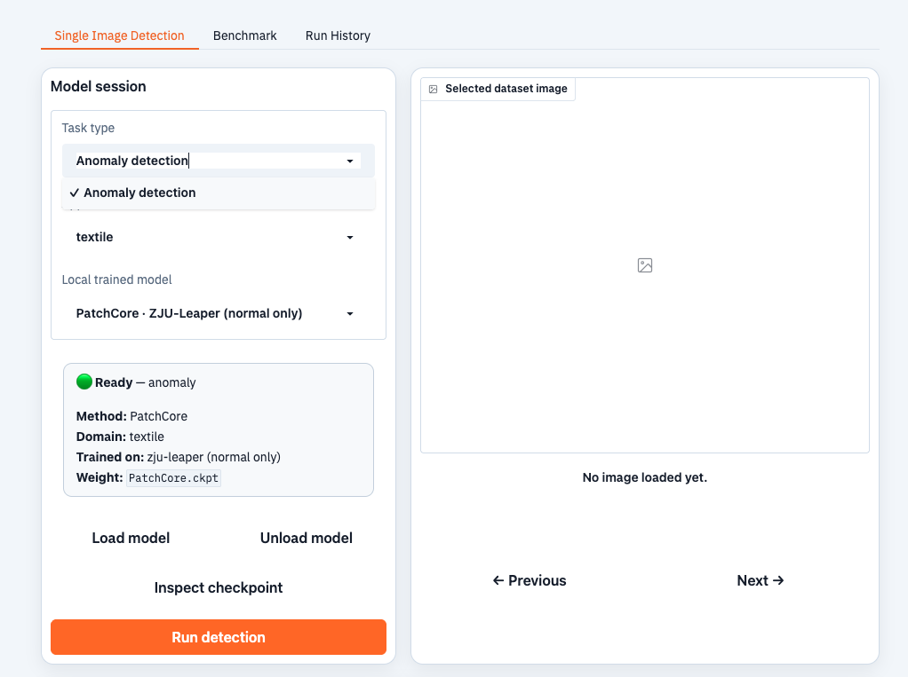
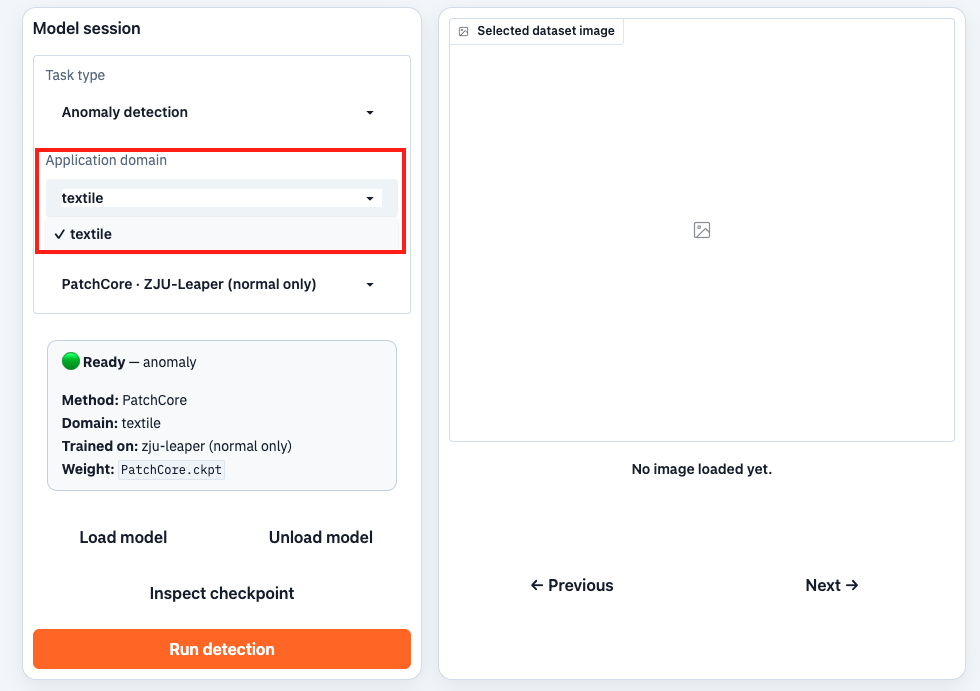
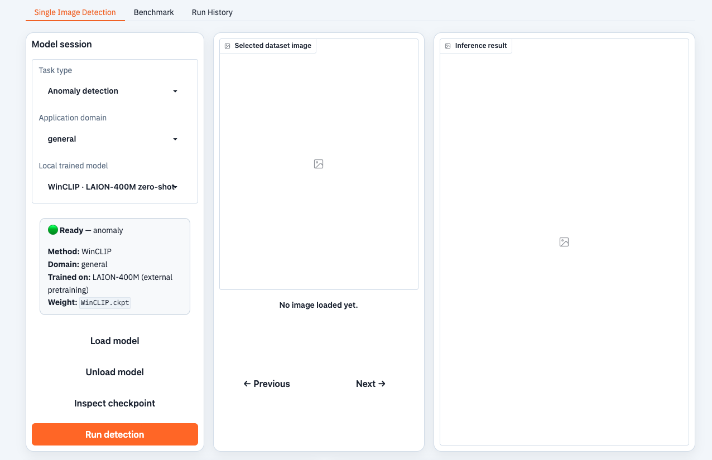
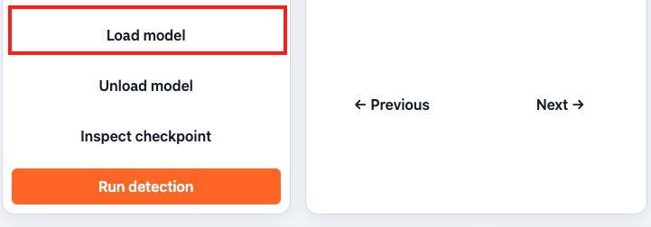
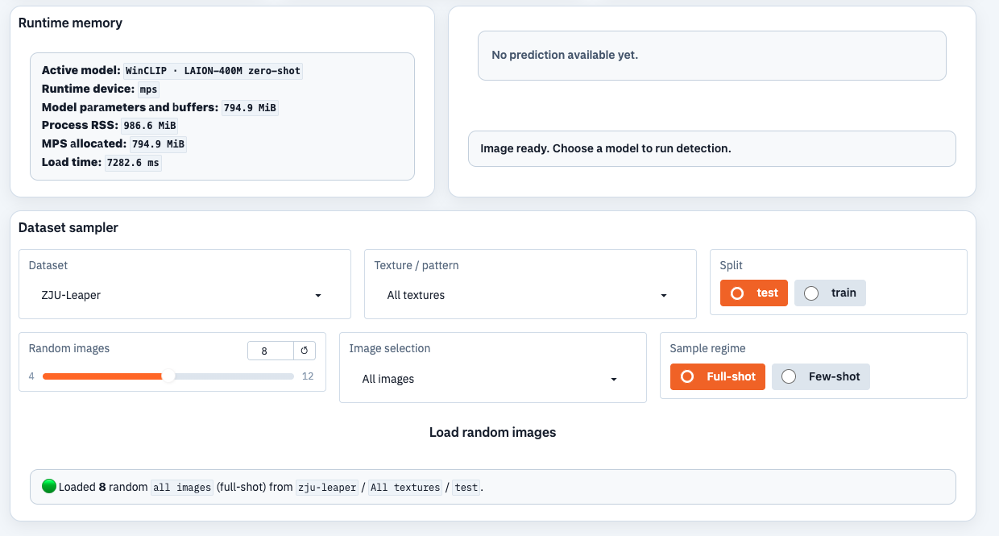
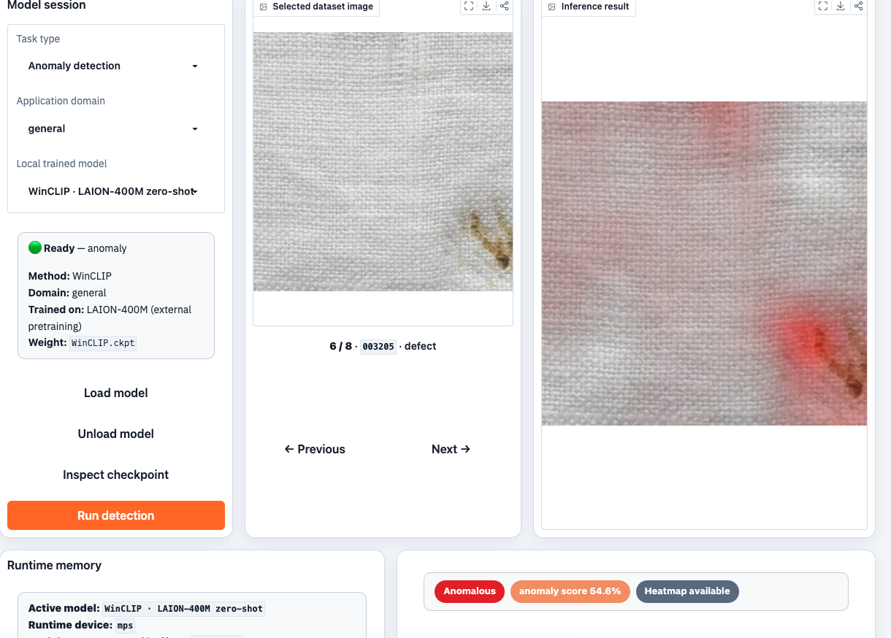

# AnomalyDetection

**One interface for supervised defect detection, and unsupervised anomaly detection.**

AnomalyDetection is an **extensible, multi-domain platform** built on **unified contracts**. It ships **nine dataset adapters** and **29 model entries**, and is operated through a **web UI**.

---

## Quick Links

<table align="center">
  <thead>
    <tr>
      <th>Resource</th>
      <th>Entry point</th>
    </tr>
  </thead>
  <tbody>
    <tr><td><strong>Requirements</strong></td><td><a href="#3-requirements">Section 3</a> — software, and hardware profiles</td></tr>
    <tr><td><strong>Install</strong></td><td><a href="#4-installation">Section 4</a> — <code>python -m pip install -r requirements-full.txt</code></td></tr>
    <tr><td><strong>Verify without data</strong></td><td><a href="#44-verify-the-installation">Section 4.4</a> — <code>adh list</code>, <code>adh inventory</code>, <code>adh doctor</code></td></tr>
    <tr><td><strong>Minimal Working Example</strong></td><td><a href="#5-minimal-working-example">Section 5</a> — a visible result on one image</td></tr>
    <tr><td><strong>Datasets</strong></td><td><a href="#8-data-preparation">Section 8</a> — nine registered datasets, three with automated download</td></tr>
    <tr><td><strong>Weights</strong></td><td><a href="#9-weight-preparation">Section 9</a> — the 19 distributed weights, and the nine trainable <code>general</code> slots</td></tr>
    <tr><td><strong>Web interface</strong></td><td><a href="#10-web-interface">Section 10</a> — <code>adh-ui</code>, default <code>http://127.0.0.1:6008</code></td></tr>
    <tr><td><strong>Command line</strong></td><td><a href="#11-command-line-workflows">Section 11</a> — <code>adh train</code>, <code>adh predict</code>, <code>adh evaluate</code>, <code>adh benchmark</code></td></tr>
    <tr><td><strong>Supported models</strong></td><td><a href="#72-supported-models">Section 7.2</a> — the 29 model identifiers of the manifest</td></tr>
    <tr><td><strong>Registered datasets</strong></td><td><a href="#73-registered-datasets">Section 7.3</a> — default roots, tasks, and training roles</td></tr>
    <tr><td><strong>Architecture</strong></td><td><a href="#6-architecture">Section 6</a> — the layering rule, the registries, and the contracts</td></tr>
    <tr><td><strong>Testing</strong></td><td><a href="#14-testing-and-quality-gates">Section 14</a> — <code>make check</code></td></tr>
    <tr><td><strong>Troubleshooting</strong></td><td><a href="#16-troubleshooting">Section 16</a> — dataset, weight, web interface, and memory problems</td></tr>
    <tr><td><strong>Recorded demonstrations</strong></td><td><a href="#105-recorded-demonstrations">Section 10.5</a> — <code>detection.mp4</code>, <code>benchmark.mp4</code></td></tr>
  </tbody>
</table>

## Outline

<a href="#1-overview">1. Overview</a><br>
&nbsp;&nbsp;&nbsp;&nbsp;<a href="#11-weights">1.1 Weights</a><br>
<a href="#2-application-domains-and-task-families">2. Application domains and task families</a><br>
&nbsp;&nbsp;&nbsp;&nbsp;<a href="#21-application-domains">2.1 Application domains</a><br>
&nbsp;&nbsp;&nbsp;&nbsp;<a href="#22-the-four-task-families">2.2 The four task families</a><br>
&nbsp;&nbsp;&nbsp;&nbsp;<a href="#23-metric-availability-rules">2.3 Metric availability rules</a><br>
<a href="#3-requirements">3. Requirements</a><br>
&nbsp;&nbsp;&nbsp;&nbsp;<a href="#31-software">3.1 Software</a><br>
&nbsp;&nbsp;&nbsp;&nbsp;<a href="#32-hardware-profiles">3.2 Hardware profiles</a><br>
<a href="#4-installation">4. Installation</a><br>
&nbsp;&nbsp;&nbsp;&nbsp;<a href="#41-obtain-the-source-and-initialise-components">4.1 Obtain the source and initialise components</a><br>
&nbsp;&nbsp;&nbsp;&nbsp;<a href="#42-create-the-python-environment">4.2 Create the Python environment</a><br>
&nbsp;&nbsp;&nbsp;&nbsp;<a href="#43-install-dependencies">4.3 Install dependencies</a><br>
&nbsp;&nbsp;&nbsp;&nbsp;<a href="#44-verify-the-installation">4.4 Verify the installation</a><br>
<a href="#5-minimal-working-example">5. Minimal Working Example</a><br>
&nbsp;&nbsp;&nbsp;&nbsp;<a href="#51-step-1-install-the-platform">5.1 Step 1: Install the platform</a><br>
&nbsp;&nbsp;&nbsp;&nbsp;<a href="#52-step-2-verify-the-installation-without-data">5.2 Step 2: Verify the installation without data</a><br>
&nbsp;&nbsp;&nbsp;&nbsp;<a href="#53-step-3-run-inference-in-the-web-interface">5.3 Step 3: Run inference in the web interface</a><br>
<a href="#6-architecture">6. Architecture</a><br>
&nbsp;&nbsp;&nbsp;&nbsp;<a href="#61-directory-layout">6.1 Directory layout</a><br>
&nbsp;&nbsp;&nbsp;&nbsp;<a href="#62-layering-and-the-dependency-rule">6.2 Layering and the dependency rule</a><br>
&nbsp;&nbsp;&nbsp;&nbsp;<a href="#63-registries">6.3 Registries</a><br>
&nbsp;&nbsp;&nbsp;&nbsp;<a href="#64-contracts">6.4 Contracts</a><br>
<a href="#7-application-domains-datasets-and-models">7. Application domains, datasets, and models</a><br>
&nbsp;&nbsp;&nbsp;&nbsp;<a href="#71-application-domains">7.1 Application domains</a><br>
&nbsp;&nbsp;&nbsp;&nbsp;<a href="#72-supported-models">7.2 Supported models</a><br>
&nbsp;&nbsp;&nbsp;&nbsp;&nbsp;&nbsp;&nbsp;&nbsp;<a href="#721-textile-application-domain">7.2.1 Textile application domain</a><br>
&nbsp;&nbsp;&nbsp;&nbsp;&nbsp;&nbsp;&nbsp;&nbsp;<a href="#722-general-application-domain">7.2.2 General application domain</a><br>
&nbsp;&nbsp;&nbsp;&nbsp;<a href="#73-registered-datasets">7.3 Registered datasets</a><br>
&nbsp;&nbsp;&nbsp;&nbsp;<a href="#74-choosing-a-model">7.4 Choosing a model</a><br>
<a href="#8-data-preparation">8. Data preparation</a><br>
&nbsp;&nbsp;&nbsp;&nbsp;<a href="#81-registered-datasets-and-default-roots">8.1 Registered datasets and default roots</a><br>
&nbsp;&nbsp;&nbsp;&nbsp;<a href="#82-staging-a-dataset-manually">8.2 Staging a dataset manually</a><br>
&nbsp;&nbsp;&nbsp;&nbsp;<a href="#83-automated-download">8.3 Automated download</a><br>
&nbsp;&nbsp;&nbsp;&nbsp;<a href="#84-verifying-data-availability">8.4 Verifying data availability</a><br>
&nbsp;&nbsp;&nbsp;&nbsp;<a href="#85-public-dataset-sources">8.5 Public dataset sources</a><br>
<a href="#9-weight-preparation">9. Weight preparation</a><br>
&nbsp;&nbsp;&nbsp;&nbsp;<a href="#91-published-slot-layout">9.1 Published-slot layout</a><br>
&nbsp;&nbsp;&nbsp;&nbsp;<a href="#92-downloading-the-distributed-weights">9.2 Downloading the distributed weights</a><br>
&nbsp;&nbsp;&nbsp;&nbsp;<a href="#93-training-a-general-domain-weight">9.3 Training a general-domain weight</a><br>
&nbsp;&nbsp;&nbsp;&nbsp;<a href="#94-verifying-weight-availability">9.4 Verifying weight availability</a><br>
&nbsp;&nbsp;&nbsp;&nbsp;<a href="#95-the-weight-manifest">9.5 The weight manifest</a><br>
<a href="#10-web-interface">10. Web interface</a><br>
&nbsp;&nbsp;&nbsp;&nbsp;<a href="#101-launch">10.1 Launch</a><br>
&nbsp;&nbsp;&nbsp;&nbsp;<a href="#102-model-session">10.2 Model session</a><br>
&nbsp;&nbsp;&nbsp;&nbsp;<a href="#103-benchmark">10.3 Benchmark</a><br>
&nbsp;&nbsp;&nbsp;&nbsp;<a href="#104-run-history">10.4 Run history</a><br>
&nbsp;&nbsp;&nbsp;&nbsp;<a href="#105-recorded-demonstrations">10.5 Recorded demonstrations</a><br>
<a href="#11-command-line-workflows">11. Command-line workflows</a><br>
&nbsp;&nbsp;&nbsp;&nbsp;<a href="#111-model-configuration-resolution">11.1 Model configuration resolution</a><br>
&nbsp;&nbsp;&nbsp;&nbsp;<a href="#112-training">11.2 Training</a><br>
&nbsp;&nbsp;&nbsp;&nbsp;<a href="#113-inference">11.3 Inference</a><br>
&nbsp;&nbsp;&nbsp;&nbsp;<a href="#114-evaluation">11.4 Evaluation</a><br>
&nbsp;&nbsp;&nbsp;&nbsp;<a href="#115-benchmarking">11.5 Benchmarking</a><br>
&nbsp;&nbsp;&nbsp;&nbsp;<a href="#116-batch-training">11.6 Batch training</a><br>
&nbsp;&nbsp;&nbsp;&nbsp;<a href="#117-catalogue-and-diagnostic-commands">11.7 Catalogue and diagnostic commands</a><br>
<a href="#12-configuration-and-environment-variables">12. Configuration and environment variables</a><br>
<a href="#13-outputs-and-reproducibility">13. Outputs and reproducibility</a><br>
&nbsp;&nbsp;&nbsp;&nbsp;<a href="#131-output-tree">13.1 Output tree</a><br>
&nbsp;&nbsp;&nbsp;&nbsp;<a href="#132-reproducibility-checklist">13.2 Reproducibility checklist</a><br>
<a href="#14-testing-and-quality-gates">14. Testing and quality gates</a><br>
<a href="#15-extending-the-platform">15. Extending the platform</a><br>
&nbsp;&nbsp;&nbsp;&nbsp;<a href="#151-add-a-model">15.1 Add a model</a><br>
&nbsp;&nbsp;&nbsp;&nbsp;<a href="#152-add-a-dataset">15.2 Add a dataset</a><br>
&nbsp;&nbsp;&nbsp;&nbsp;<a href="#153-add-an-application-domain">15.3 Add an application domain</a><br>
<a href="#16-troubleshooting">16. Troubleshooting</a><br>
<a href="#17-tools-reference">17. Tools reference</a><br>
<a href="#18-terminology">18. Terminology</a><br>
<a href="#19-additional-documentation">19. Additional documentation</a><br>

---

## 1. Overview

- **Motivation.** Industrial inspection requires three capabilities: a model that **localizes**
  defects, a model that **outlines** them, and a model that **flags an outlier** when no defect
  class was defined. Each capability is served by a separate dataset, annotation format, and
  research codebase.

- **Design: one interface, many backends.** Rather than one pipeline per framework, the platform
  defines unified data contracts — `Sample`, `Prediction`, and `ExperimentResult` — and every
  backend implements the same **`ModelAdapter`** contract. A backend declares its capabilities
  once, and every consumer (CLI, web interface, evaluator, profiler) reads that declaration
  rather than inferring it.

- **Model catalogue.** The **model manifest**
  ([`configs/registry/models.yaml`](configs/registry/models.yaml)) is the authoritative catalogue
  of published models: method, task, application domain, training corpus, evaluation corpora,
  model configuration, and weight source. Adding one conforming entry updates **every** consumer.

- **Evaluation.** Four **task families** are scored by four evaluators with declared **metric
  keys** ([Section 2](#2-application-domains-and-task-families)). A metric that cannot be
  computed is reported as **unavailable**, never inferred from output the model does not produce.

- **Provenance.** Every training run appends a **provenance record** — timestamp, Git revision,
  working-tree state, host, platform, package versions, component revisions — to an append-only
  **weight manifest**; every evaluation is appended to a **run log**.

### 1.1 Weights

- **Distributed by the project:** the textile-trained weights, and the WinCLIP and MoECLIP
  adapters ([Section 9.2](#92-downloading-the-distributed-weights)).
- **Trained by the user:** the nine general training slots, which declare no weight
  ([Section 9.3](#93-training-a-general-domain-weight)).

## 2. Application domains and task families

### 2.1 Application domains

Models, algorithms, and datasets are grouped by **application domain**. The `general` domain holds
the domain-independent methods and datasets, which is most of the platform; `textile` is the
domain-specific group registered today, and further groups such as `pcb` are added the same way
([Section 15.3](#153-add-an-application-domain), [Section 7.1](#71-application-domains)).

Of the domain-specific groups, only **`textile`** is provided. To use any other domain, train the
model on that domain's datasets ([Section 9.3](#93-training-a-general-domain-weight)).

### 2.2 The four task families

The platform solves four task families through one interface. A backend fills only the prediction
fields that its capability declaration reports.

<table align="center">
  <thead>
    <tr>
      <th>Task family</th>
      <th>Required annotation</th>
      <th>Prediction fields</th>
      <th>Evaluator</th>
      <th>Headline metric</th>
      <th>Metric keys</th>
    </tr>
  </thead>
  <tbody>
    <tr>
      <td>Supervised defect detection</td>
      <td><code>boxes</code>, <code>labels</code></td>
      <td><code>boxes</code>, <code>labels</code>, <code>scores</code></td>
      <td><code>detection</code></td>
      <td><code>map</code></td>
      <td><code>map</code>, <code>map_50</code>, <code>map_75</code>, <code>map_small</code>, <code>map_medium</code>, <code>map_large</code>, <code>mar_1</code>, <code>mar_10</code>, <code>mar_100</code>, <code>precision_at_threshold</code>, <code>recall_at_threshold</code>, <code>f1_at_threshold</code>, <code>recall_small</code>, <code>recall_normal</code></td>
    </tr>
    <tr>
      <td>Supervised defect segmentation</td>
      <td><code>masks</code></td>
      <td><code>masks</code></td>
      <td><code>segmentation</code></td>
      <td><code>miou</code></td>
      <td><code>miou</code>, <code>dice</code>, <code>pixel_f1</code>, <code>num_evaluated</code>, <code>num_skipped_empty</code></td>
    </tr>
    <tr>
      <td>Industrial anomaly detection</td>
      <td><code>is_anomalous</code></td>
      <td><code>anomaly_score</code>, and <code>anomaly_map</code> when supported</td>
      <td><code>anomaly</code></td>
      <td><code>image_auroc</code></td>
      <td><code>image_auroc</code>, <code>image_f1</code>, <code>image_precision</code>, <code>image_recall</code>, <code>image_threshold</code>, <code>pixel_auroc</code>, <code>pixel_f1</code>, <code>pixel_aupro</code>, <code>iap</code></td>
    </tr>
    <tr>
      <td>Production-line anomaly detection</td>
      <td><code>is_anomalous</code>, and a unit length per sample</td>
      <td><code>anomaly_score</code></td>
      <td><code>industrial</code></td>
      <td>Not declared</td>
      <td><code>under_detection_rate</code>, <code>over_detection_rate</code>, <code>chosen_threshold</code>, <code>num_alarms</code>, <code>num_samples</code>, <code>alarms_per_unit_length</code></td>
    </tr>
  </tbody>
</table>

The **task of a dataset sample**, not a global setting, selects the evaluator; `--task` forces a
specific evaluator instead ([Section 11.4](#114-evaluation)). The **`industrial`** family is
implemented and evaluable, but **no published model identifier declares it** — it is exercised
through the Python API and the evaluator contract.

### 2.3 Metric availability rules

Three rules determine which metric keys are computable.

1. Image-level anomaly metrics require a sample label and a prediction score.
2. Pixel-level anomaly metrics require a ground-truth mask and a model-produced anomaly map. A
   model that does not declare `anomaly_map` produces no heat map; GANomaly is one such model.
3. The `instance_segmentation` task is scored by the `segmentation` evaluator over a unioned
   binary mask.

---

## 3. Requirements

### 3.1 Software

<table align="center">
  <thead>
    <tr>
      <th>Item</th>
      <th>Requirement</th>
    </tr>
  </thead>
  <tbody>
    <tr><td><strong>Python</strong></td><td><strong>3.10 or newer</strong> is required. <strong>3.11–3.13</strong> are recommended for training, because PyTorch emits TorchScript deprecation warnings on 3.14. This document uses <strong>3.12</strong>.</td></tr>
    <tr><td><strong>Environment manager</strong></td><td><strong>Conda</strong> is recommended. The name <code>anomalib_env</code> is historical and does not restrict which backends may be installed.</td></tr>
    <tr><td><strong>Operating system</strong></td><td><strong>macOS or Linux.</strong></td></tr>
    <tr><td><strong>Graphics processing unit</strong></td><td><strong>Optional for inference.</strong> A CUDA-capable NVIDIA GPU is recommended for training.</td></tr>
    <tr><td><strong>CUDA</strong></td><td>Required only for NVIDIA acceleration and for the CUDA-only optional dependency groups.</td></tr>
    <tr><td><strong>Git</strong></td><td>Required, because three components are Git submodules.</td></tr>
  </tbody>
</table>

### 3.2 Hardware profiles

These figures are **recommendations, not guaranteed minimums**. On a constrained machine, use a
smaller **batch size** and the **`test` shot mode**.

<table align="center">
  <thead>
    <tr>
      <th>Workflow</th>
      <th>Processor and memory</th>
      <th>Graphics processing unit</th>
      <th>Disk</th>
    </tr>
  </thead>
  <tbody>
    <tr><td>Catalogue inspection, test suite, web interface layout</td><td>4 or more cores, 16 GB RAM</td><td>Not required</td><td>10 GB, plus the weights</td></tr>
    <tr><td>Minimal Working Example inference</td><td>8 or more cores, 16 GB RAM</td><td>Optional</td><td>The weights, plus the selected dataset</td></tr>
    <tr><td>Full textile training</td><td>8 or more cores, 32 GB RAM</td><td>NVIDIA recommended; capacity depends on the model and the batch size</td><td>The dataset and the run artifacts, typically tens of GB</td></tr>
    <tr><td>Full benchmark suite</td><td>16 or more cores, 32 GB to 64 GB RAM</td><td>Recommended</td><td>All datasets, weights, anomaly maps, exports, and logs</td></tr>
  </tbody>
</table>

---

## 4. Installation

### 4.1 Obtain the source and initialise components

```bash
git clone --recurse-submodules https://github.com/LINC-BIT/AnomalyDetection.git
cd AnomalyDetection
```

If the repository was cloned without the `--recurse-submodules` option, initialise the components
explicitly.

```bash
git submodule update --init --recursive
git submodule status
```

Expected result of `git submodule status`: three lines, one each for
`components/anomalydiffusion`, `components/dinomaly`, and `components/moeclip`, each beginning
with the pinned revision.

**Do not clone a component repository manually.** The parent repository pins the tested revision
through `.gitmodules` and a Git link.

### 4.2 Create the Python environment

```bash
conda create -n anomalib_env python=3.12 -y
conda activate anomalib_env
python --version
```

Expected result: the shell prompt is prefixed with `(anomalib_env)`.

### 4.3 Install dependencies

<table align="center">
  <thead>
    <tr>
      <th>Dependency set</th>
      <th>Contents</th>
      <th>Installation command</th>
    </tr>
  </thead>
  <tbody>
    <tr><td>Complete</td><td>All six backends, the profiling and quantization dependencies, and the test dependencies. The last installation directive in the file is <code>-e .</code>, so it also installs the project itself in editable mode; the remaining lines are commented-out NVIDIA-only extras.</td><td><code>python -m pip install -r requirements-full.txt</code></td></tr>
    <tr><td>Lean</td><td>The web interface and lightweight inference only. This file does not install the project itself, so the editable installation is a separate command.</td><td><code>python -m pip install -r requirements.txt</code><br><code>python -m pip install --no-deps --no-build-isolation -e .</code></td></tr>
  </tbody>
</table>

Optional dependency groups are declared in `pyproject.toml`.

```bash
python -m pip install -e ".[mambaad-cuda]"           # CUDA-only fused selective-scan kernel
python -m pip install -e ".[profiling-onnxruntime]"  # ONNX Runtime profiler
python -m pip install -e ".[profiling-flops]"        # FLOPs counter
python -m pip install -e ".[profiling-power-nvidia]" # NVIDIA power draw through NVML
python -m pip install -e ".[profiling-tensorrt]"     # TensorRT profiler; NVIDIA hardware only
python -m pip install -e ".[quantization]"           # fp16 and INT8 ONNX quantization
```

The `Makefile` provides the same two dependency sets as `make install` and `make install-ui`.

### 4.4 Verify the installation

Four commands verify the installation, and **none of them needs a dataset or a weight**. The
first, `python examples/01_inspect_catalog.py`, is stated in
[Section 5.2](#52-step-2-verify-the-installation-without-data); the other three are here.

```bash
adh list
```

Expected output on a machine with all six frameworks installed:

```json
{
  "datasets": ["fabric-defects", "fabric-train", "mvtec-ad", "mvtec-loco", "raw-fabric", "tianchi", "tilda-400", "visa", "zju-leaper"],
  "model_backends": {
    "known": ["anomalib", "dinomaly", "mambaad", "moeclip", "torchvision", "ultralytics"],
    "available": ["anomalib", "dinomaly", "mambaad", "moeclip", "torchvision", "ultralytics"]
  },
  "evaluators": ["anomaly", "detection", "industrial", "segmentation"],
  "profilers": ["onnxruntime", "pytorch", "tensorrt"]
}
```

`model_backends.known` lists every backend the project supports;
`model_backends.available` lists the backends whose framework is importable on this machine.

```bash
adh inventory
```

Expected result: a JSON object with the keys `models` and `datasets`; each `models` entry states
one manifest record in full.

```bash
adh doctor
```

Expected result: a JSON object keyed by backend. `trainable_now` is true only when both the
framework and a suitable dataset are available, and `reason` names the selected dataset.

```json
{
  "backends": {
    "anomalib": {
      "framework_installed": true,
      "dataset_kind": "one-class",
      "dataset": "fabric-defects",
      "trainable_now": true,
      "reason": "No dataset was requested; picked 'fabric-defects' (staged). Other staged alternatives: fabric-train, mvtec-ad, mvtec-loco, raw-fabric, tianchi, tilda-400, visa, zju-leaper."
    }
  }
}
```

The real output contains one such entry for each of the six backends. The selected dataset
depends on which datasets are staged on the machine.

---

## 5. Minimal Working Example

This section is the shortest path from a clean checkout to a visible result.

### 5.1 Step 1: Install the platform

The canonical clone URL is **`https://github.com/LINC-BIT/AnomalyDetection.git`**; no mirror is
published. The full procedure — the lean and complete dependency sets, optional groups, and the
submodule check — is in [Section 4](#4-installation).

```bash
git clone --recurse-submodules https://github.com/LINC-BIT/AnomalyDetection.git
cd AnomalyDetection
conda create -n anomalib_env python=3.12 -y
conda activate anomalib_env
git submodule update --init --recursive
python -m pip install -r requirements-full.txt
```

### 5.2 Step 2: Verify the installation without data

The following commands require no dataset and no weight.

```bash
python examples/01_inspect_catalog.py
adh list
adh inventory
adh doctor
```

Expected output, as recorded on the development machine:

```text
AnomalyDetection version: 0.2.0
Registered models: 29
Registered datasets: 9
Models: yolov8n, yolov8s, yolo11n, fasterrcnn_resnet50_fpn, cascadercnn_resnet50_fpn, detr_resnet50, maskrcnn_resnet50_fpn, unetplusplus_resnet34, deeplabv3plus_resnet50, PatchCore, PaDiM, RD4AD, EfficientAD, SuperSimpleNet, STFPM, GANomaly, WinCLIP, Dinomaly, MoECLIP, MambaAD, PatchCore_general, PaDiM_general, RD4AD_general, EfficientAD_general, SuperSimpleNet_general, STFPM_general, GANomaly_general, Dinomaly_general, MambaAD_general
Datasets: fabric-defects, fabric-train, mvtec-ad, mvtec-loco, raw-fabric, tianchi, tilda-400, visa, zju-leaper
```

The remaining expected outputs are in [Section 4.4](#44-verify-the-installation).

If a command fails, read [Section 16](#16-troubleshooting) before continuing.

### 5.3 Step 3: Run inference in the web interface

**Launch.** Start the web interface as described in [Section 10.1](#101-launch).

```bash
adh-ui
```

**Open the URL.** The default URL is `http://127.0.0.1:6008`.

**Select the task type.** In **Task type**, select **Anomaly detection**.

<p align="center"></p>

**Select the application domain.** In **Application domain**, select `general`, because the model
used in this example belongs to the `general` domain.

<p align="center"></p>

**Select the model.** In **Model**, select `WinCLIP · LAION-400M zero-shot`. Confirm that the panel
states the application domain `general` and the published slot
`general/artifacts/models/published/WinCLIP.ckpt`.

<p align="center"></p>

If that published slot is empty locally, substitute any model identifier whose
`weight_status` field is `file` or `symlink` in the output of `adh inventory`
([Section 9.4](#94-verifying-weight-availability)).

**Load the model.** Select **Load model**, and wait until the status reports the model as loaded.

<p align="center"></p>

**Select the dataset.** Select the dataset `ZJU-Leaper`, a pattern or **All textures**, and the
`test` split. Select **Full-shot**, then **Load random images**.

<p align="center"></p>

**Run detection.** Select **Run detection**, and wait for the process to finish.

<p align="center"></p>

Expected result: the gallery displays the loaded images and the anomaly score of each image and,
for a model that reports an anomaly map, the anomaly heat map.

Reference anomaly scores, runtime, and a completed-run capture are **not provided**.

---

## 6. Architecture

### 6.1 Directory layout

```text
AnomalyDetection/
├── src/fabric_defect_hub/            # reusable SDK; the import name is historical
│   ├── application/                  # business services used by the CLI and the web interface
│   ├── core/                         # registries, contracts, provenance, configuration
│   ├── datasets/                     # DatasetAdapter implementations
│   ├── models/                       # ModelAdapter implementations, one package per backend
│   ├── evaluation/                   # backend-independent metric computation
│   ├── profiling/                    # runtime and resource measurement
│   ├── quantization/                 # post-training ONNX and TensorRT quantization
│   ├── recipes/                      # optimization recipes
│   ├── reporting/                    # run log, tables, LaTeX export, training curves
│   ├── strategies/                   # sparse subsampling, tiling, test-time augmentation
│   └── web/                          # presentation and event binding only
├── components/                       # pinned upstream research checkouts (Git submodules)
├── configs/
│   ├── registry/models.yaml          # the model manifest: the published-model source of truth
│   ├── models/                       # model configurations (textile)
│   └── training_profile.yaml         # the shared training profile
├── datasets/
│   ├── textile/                      # textile datasets
│   └── general/                      # MVTec AD, MVTec LOCO, VisA, and auxiliary data
├── general/                          # general assets and artifacts
│   ├── configs/models/               # model configurations (general)
│   └── artifacts/models/published/   # general published slots
├── textile/                          # textile assets and artifacts
│   └── artifacts/models/published/   # textile published slots
├── examples/                         # Minimal Working Example scripts
├── tools/                            # conversion, export, download, and benchmark tools
├── tests/                            # runtime contracts and architecture audits
├── schemas/                          # JSON Schemas for the unified contracts
└── docs/                             # focused guides and design records
```

### 6.2 Layering and the dependency rule

A layer may import the layers above it in the following list and **must not import the layers
below it**.

1. `core/` — contracts, registries, and utilities. Imports no backend.
2. `datasets/`, `models/`, `evaluation/`, `profiling/`, `quantization/`, `recipes/` —
   implementations of the contracts.
3. `application/` — business services. The only supported boundary for the CLI and the web
   interface.
4. `cli.py` and `web/` — presentation.

**Two mechanisms enforce this rule.** `tests/test_web_layering.py` parses every module of `web/`
with `ast` and fails if a module imports a backend package or contains a backend name as a string
literal. The **`architecture`** pytest marker, declared in `pyproject.toml`, runs the
source-boundary audits.

### 6.3 Registries

Two registries answer **two different questions**.

1. The backend registry answers how an implementation runs. A decorator registers each
   implementation: `@register_model`, `@register_dataset`, `@register_evaluator`,
   `@register_profiler`, and `@register_recipe`.
2. The model manifest answers which concrete model is published: its method, task, integration,
   application domain, training corpus, evaluation corpora, model configuration, and weight
   source.

The application services join the two registries, so **adding a conforming entry to the model
manifest updates every consumer**.

### 6.4 Contracts

<table align="center">
  <thead>
    <tr>
      <th>Contract</th>
      <th>Module</th>
      <th>Responsibility</th>
    </tr>
  </thead>
  <tbody>
    <tr><td><code>ModelAdapter</code></td><td><code>models/base.py</code></td><td>Defines <code>train</code>, <code>predict</code>, <code>export</code>, <code>load_trained_model</code>, and <code>capabilities</code>. The signatures are identical for every backend, including parameters that a given backend ignores.</td></tr>
    <tr><td><code>ModelCapabilities</code></td><td><code>models/base.py</code></td><td>Declares the tasks, the <code>Prediction</code> fields, the required annotations, the export targets, and the exported input style of a model. Every name is validated against a fixed vocabulary at import time.</td></tr>
    <tr><td><code>DatasetAdapter</code></td><td><code>datasets/base.py</code></td><td>Converts a source dataset into <code>Sample</code> objects.</td></tr>
    <tr><td><code>DatasetCapabilities</code></td><td><code>core/dataset_capabilities.py</code></td><td>Declares the default root, the training roles, the tasks, and the application domain of a dataset. This module is the single source of truth for what a dataset may be used for.</td></tr>
    <tr><td><code>DataAdapter</code></td><td><code>core/data_adapter.py</code></td><td>Converts <code>Sample</code> objects into backend batches, and declares the resulting batch layout through <code>BatchSpec</code>.</td></tr>
    <tr><td><code>Sample</code>, <code>Prediction</code>, <code>ExperimentResult</code></td><td><code>core/types.py</code></td><td>The unified data contracts, whose JSON representations are specified by <code>schemas/sample.schema.json</code>, <code>schemas/prediction.schema.json</code>, and <code>schemas/experiment_result.schema.json</code>.</td></tr>
    <tr><td><code>Evaluator</code></td><td><code>evaluation/base.py</code></td><td>Computes metrics from <code>Sample</code> and <code>Prediction</code> objects. An evaluator imports no backend.</td></tr>
    <tr><td><code>BackendProfiler</code></td><td><code>profiling/base.py</code></td><td>Measures the runtime and the resource consumption of an exported model.</td></tr>
  </tbody>
</table>

---

## 7. Application domains, datasets, and models

### 7.1 Application domains

An application domain is a data family together with its assets. Two domains are registered.

<table align="center">
  <thead>
    <tr>
      <th>Application domain</th>
      <th>Assets</th>
      <th>Datasets</th>
      <th>Published slots</th>
    </tr>
  </thead>
  <tbody>
    <tr><td><code>textile</code></td><td><code>textile/</code>, plus the shared <code>datasets/textile/</code></td><td><code>zju-leaper</code>, <code>raw-fabric</code>, <code>tilda-400</code>, <code>fabric-defects</code>, <code>tianchi</code>, <code>fabric-train</code></td><td><code>textile/artifacts/models/published/</code></td></tr>
    <tr><td><code>general</code></td><td><code>general/</code>, plus the shared <code>datasets/general/</code></td><td><code>mvtec-ad</code>, <code>mvtec-loco</code>, <code>visa</code></td><td><code>general/artifacts/models/published/</code></td></tr>
  </tbody>
</table>

The **`domain`** field of the manifest records the application domain of a weight, and a training
run publishes its weight into the slot of the **domain of the training dataset**. **A weight must
not be relabelled** from one application domain to another.

### 7.2 Supported models

The model manifest is authoritative. Run `adh inventory` for the machine-readable view and
`adh models` for the backend-grouped view.

The manifest declares **29 model identifiers**: **18** in `textile` and **11** in `general`. Two
identifiers may share a backend and a variant when they belong to **different application
domains** — which is the case for the nine general training slots. The textile entries and
`MoECLIP` are distributed with weights; the **nine general training slots** are not
([Section 9.3](#93-training-a-general-domain-weight)).

#### 7.2.1 Textile application domain

<table align="center">
  <thead>
    <tr>
      <th>Model identifier</th>
      <th>Backend</th>
      <th>Model variant</th>
      <th>Task</th>
      <th>Method</th>
      <th>Training corpus and protocol</th>
    </tr>
  </thead>
  <tbody>
    <tr><td><code>yolov8n</code></td><td><code>ultralytics</code></td><td><code>yolov8n</code></td><td><code>detection</code></td><td>YOLO</td><td>ZJU-Leaper</td></tr>
    <tr><td><code>yolov8s</code></td><td><code>ultralytics</code></td><td><code>yolov8s</code></td><td><code>detection</code></td><td>YOLO</td><td>ZJU-Leaper</td></tr>
    <tr><td><code>yolo11n</code></td><td><code>ultralytics</code></td><td><code>yolo11n</code></td><td><code>detection</code></td><td>YOLO</td><td>ZJU-Leaper</td></tr>
    <tr><td><code>fasterrcnn_resnet50_fpn</code></td><td><code>torchvision</code></td><td><code>fasterrcnn_resnet50_fpn</code></td><td><code>detection</code></td><td>Faster R-CNN</td><td>ZJU-Leaper</td></tr>
    <tr><td><code>cascadercnn_resnet50_fpn</code></td><td><code>torchvision</code></td><td><code>cascadercnn_resnet50_fpn</code></td><td><code>detection</code></td><td>Cascade R-CNN</td><td>ZJU-Leaper</td></tr>
    <tr><td><code>detr_resnet50</code></td><td><code>torchvision</code></td><td><code>detr_resnet50</code></td><td><code>detection</code></td><td>DETR</td><td>ZJU-Leaper</td></tr>
    <tr><td><code>maskrcnn_resnet50_fpn</code></td><td><code>torchvision</code></td><td><code>maskrcnn_resnet50_fpn</code></td><td><code>instance_segmentation</code></td><td>Mask R-CNN</td><td>ZJU-Leaper</td></tr>
    <tr><td><code>unetplusplus_resnet34</code></td><td><code>torchvision</code></td><td><code>unetplusplus_resnet34</code></td><td><code>segmentation</code></td><td>UNet++</td><td>ZJU-Leaper</td></tr>
    <tr><td><code>deeplabv3plus_resnet50</code></td><td><code>torchvision</code></td><td><code>deeplabv3plus_resnet50</code></td><td><code>segmentation</code></td><td>DeepLabV3+</td><td>ZJU-Leaper</td></tr>
    <tr><td><code>PatchCore</code></td><td><code>anomalib</code></td><td><code>PatchCore</code></td><td><code>anomaly</code></td><td>PatchCore</td><td>ZJU-Leaper, normal-only split</td></tr>
    <tr><td><code>PaDiM</code></td><td><code>anomalib</code></td><td><code>PaDiM</code></td><td><code>anomaly</code></td><td>PaDiM</td><td>ZJU-Leaper, normal-only split</td></tr>
    <tr><td><code>RD4AD</code></td><td><code>anomalib</code></td><td><code>RD4AD</code></td><td><code>anomaly</code></td><td>Reverse Distillation</td><td>ZJU-Leaper, normal-only split</td></tr>
    <tr><td><code>EfficientAD</code></td><td><code>anomalib</code></td><td><code>EfficientAD</code></td><td><code>anomaly</code></td><td>EfficientAD</td><td>ZJU-Leaper, normal-only split</td></tr>
    <tr><td><code>SuperSimpleNet</code></td><td><code>anomalib</code></td><td><code>SuperSimpleNet</code></td><td><code>anomaly</code></td><td>SuperSimpleNet</td><td>ZJU-Leaper, normal-only split</td></tr>
    <tr><td><code>STFPM</code></td><td><code>anomalib</code></td><td><code>STFPM</code></td><td><code>anomaly</code></td><td>STFPM</td><td>ZJU-Leaper, normal-only split</td></tr>
    <tr><td><code>GANomaly</code></td><td><code>anomalib</code></td><td><code>GANomaly</code></td><td><code>anomaly</code></td><td>GANomaly</td><td>ZJU-Leaper, normal-only split; image-level score only</td></tr>
    <tr><td><code>Dinomaly</code></td><td><code>dinomaly</code></td><td><code>dinov2reg_vit_base_14</code></td><td><code>anomaly</code></td><td>Dinomaly</td><td>ZJU-Leaper, normal-only split</td></tr>
    <tr><td><code>MambaAD</code></td><td><code>mambaad</code></td><td><code>resnet34</code></td><td><code>anomaly</code></td><td>MambaAD</td><td>ZJU-Leaper, normal-only split; published slot empty</td></tr>
  </tbody>
</table>

#### 7.2.2 General application domain

<table align="center">
  <thead>
    <tr>
      <th>Model identifier</th>
      <th>Backend</th>
      <th>Model variant</th>
      <th>Task</th>
      <th>Method</th>
      <th>Training corpus and protocol</th>
    </tr>
  </thead>
  <tbody>
    <tr><td><code>WinCLIP</code></td><td><code>anomalib</code></td><td><code>WinClip</code></td><td><code>anomaly</code></td><td>WinCLIP</td><td>External LAION-400M pretraining; zero-shot. ZJU-Leaper is an evaluation target only.</td></tr>
    <tr><td><code>MoECLIP</code></td><td><code>moeclip</code></td><td><code>ViT-L-14-336</code></td><td><code>anomaly</code></td><td>MoECLIP</td><td>MVTec AD auxiliary anomaly training; evaluated on ZJU-Leaper</td></tr>
    <tr><td><code>PatchCore_general</code></td><td><code>anomalib</code></td><td><code>PatchCore</code></td><td><code>anomaly</code></td><td>PatchCore</td><td>General training slot; no weight trained yet</td></tr>
    <tr><td><code>PaDiM_general</code></td><td><code>anomalib</code></td><td><code>PaDiM</code></td><td><code>anomaly</code></td><td>PaDiM</td><td>General training slot; no weight trained yet</td></tr>
    <tr><td><code>RD4AD_general</code></td><td><code>anomalib</code></td><td><code>RD4AD</code></td><td><code>anomaly</code></td><td>Reverse Distillation</td><td>General training slot; no weight trained yet</td></tr>
    <tr><td><code>EfficientAD_general</code></td><td><code>anomalib</code></td><td><code>EfficientAD</code></td><td><code>anomaly</code></td><td>EfficientAD</td><td>General training slot; no weight trained yet</td></tr>
    <tr><td><code>SuperSimpleNet_general</code></td><td><code>anomalib</code></td><td><code>SuperSimpleNet</code></td><td><code>anomaly</code></td><td>SuperSimpleNet</td><td>General training slot; no weight trained yet</td></tr>
    <tr><td><code>STFPM_general</code></td><td><code>anomalib</code></td><td><code>STFPM</code></td><td><code>anomaly</code></td><td>STFPM</td><td>General training slot; no weight trained yet</td></tr>
    <tr><td><code>GANomaly_general</code></td><td><code>anomalib</code></td><td><code>GANomaly</code></td><td><code>anomaly</code></td><td>GANomaly</td><td>General training slot; no weight trained yet</td></tr>
    <tr><td><code>Dinomaly_general</code></td><td><code>dinomaly</code></td><td><code>dinov2reg_vit_base_14</code></td><td><code>anomaly</code></td><td>Dinomaly</td><td>General training slot; no weight trained yet</td></tr>
    <tr><td><code>MambaAD_general</code></td><td><code>mambaad</code></td><td><code>resnet34</code></td><td><code>anomaly</code></td><td>MambaAD</td><td>General training slot; no weight trained yet</td></tr>
  </tbody>
</table>

### 7.3 Registered datasets

Nine dataset identifiers are registered.

<table align="center">
  <thead>
    <tr>
      <th>Dataset identifier</th>
      <th>Application domain</th>
      <th>Default root</th>
      <th>Tasks</th>
      <th>Training roles</th>
    </tr>
  </thead>
  <tbody>
    <tr><td><code>zju-leaper</code></td><td><code>textile</code></td><td><code>datasets/textile/ZJU-Leaper</code></td><td><code>detection</code>, <code>segmentation</code>, <code>anomaly</code></td><td><code>anomaly_train</code>, <code>detection_train</code>, <code>fabric_train_member</code></td></tr>
    <tr><td><code>raw-fabric</code></td><td><code>textile</code></td><td><code>datasets/textile/RAW_FABRID</code></td><td><code>anomaly</code>, <code>segmentation</code></td><td><code>anomaly_train</code>, <code>fabric_train_member</code></td></tr>
    <tr><td><code>tilda-400</code></td><td><code>textile</code></td><td><code>datasets/textile/TILDA_400</code></td><td><code>anomaly</code></td><td><code>anomaly_train</code>, <code>fabric_train_member</code></td></tr>
    <tr><td><code>fabric-defects</code></td><td><code>textile</code></td><td><code>datasets/textile/Fabric Defects Dataset</code></td><td><code>anomaly</code>, <code>segmentation</code></td><td><code>anomaly_train</code>, <code>fabric_train_member</code></td></tr>
    <tr><td><code>tianchi</code></td><td><code>textile</code></td><td><code>datasets/textile/tianchi</code></td><td><code>detection</code>, <code>anomaly</code></td><td><code>anomaly_train</code>, <code>detection_train</code>, <code>fabric_train_member</code></td></tr>
    <tr><td><code>fabric-train</code></td><td><code>textile</code></td><td><code>datasets/textile</code></td><td><code>detection</code>, <code>segmentation</code>, <code>anomaly</code></td><td><code>anomaly_train</code></td></tr>
    <tr><td><code>mvtec-ad</code></td><td><code>general</code></td><td><code>datasets/general/MVTec AD</code></td><td><code>anomaly</code>, <code>segmentation</code></td><td><code>anomaly_train</code>, <code>zero_shot_train</code></td></tr>
    <tr><td><code>mvtec-loco</code></td><td><code>general</code></td><td><code>datasets/general/MVTec LOCO</code></td><td><code>anomaly</code>, <code>segmentation</code></td><td><code>anomaly_train</code>, <code>zero_shot_train</code></td></tr>
    <tr><td><code>visa</code></td><td><code>general</code></td><td><code>datasets/general/VisA</code></td><td><code>anomaly</code>, <code>segmentation</code></td><td><code>anomaly_train</code>, <code>zero_shot_train</code></td></tr>
  </tbody>
</table>

The training roles have the following meanings.

1. `anomaly_train` — the dataset supplies a normal-only split, so it is a valid training corpus
   for the one-class anomaly backends `anomalib`, `dinomaly`, and `mambaad`.
2. `zero_shot_train` — the dataset supplies labelled anomalies, so it is a valid auxiliary
   training corpus for the zero-shot backend `moeclip`. A dataset may hold both this role and
   `anomaly_train`.
3. `detection_train` — the dataset supplies bounding-box annotations, so it is a valid training
   corpus for the detection backends `ultralytics` and `torchvision`.
4. `fabric_train_member` — the dataset contributes samples to the `fabric-train` composite.

A dataset that declares **none** of these roles **can be evaluated but not trained on**. The
`fabric-train` composite is not a member of its own union.

### 7.4 Choosing a model

The manifests and the diagnosis commands answer most selection questions directly.

<table align="center">
  <thead>
    <tr>
      <th>Question</th>
      <th>Command or field</th>
    </tr>
  </thead>
  <tbody>
    <tr><td>Which models are published?</td><td><code>adh inventory</code>, or the tables of <a href="#72-supported-models">Section 7.2</a></td></tr>
    <tr><td>Which model variants does a backend support?</td><td><code>adh models</code>, optionally restricted with <code>--backend</code></td></tr>
    <tr><td>Which backend is trainable on this machine right now?</td><td><code>adh doctor</code>, field <code>trainable_now</code></td></tr>
    <tr><td>Which dataset would a backend pick?</td><td><code>adh doctor</code>, field <code>dataset</code> and <code>reason</code></td></tr>
    <tr><td>Which model configurations can a training command resolve?</td><td><code>adh train --list</code></td></tr>
    <tr><td>Which model has a usable weight?</td><td><code>adh inventory</code>, field <code>weight_status</code></td></tr>
  </tbody>
</table>

---

## 8. Data preparation

### 8.1 Registered datasets and default roots

A dataset is available to the command-line interface when its directory exists at the **declared
default root**, relative to the repository root. The roots are listed in
[Section 7.3](#73-registered-datasets) and are declared once in `core/dataset_capabilities.py`.
The **`--dataset-root`** option overrides the declared root for one command.

### 8.2 Staging a dataset manually

1. Create the declared default root directory.
2. Copy the dataset into it, preserving the directory structure that the dataset adapter expects.
3. Confirm the result with `adh doctor`, then with a training run in `test` shot mode.

```bash
mkdir -p "datasets/general/MVTec LOCO"
# Copy the extracted dataset into that directory.
adh doctor
```

The directory structure that each adapter expects is documented in the module docstring of that
adapter.

<table align="center">
  <thead>
    <tr>
      <th>Dataset identifier</th>
      <th>Adapter module</th>
      <th>Automated download</th>
    </tr>
  </thead>
  <tbody>
    <tr><td><code>zju-leaper</code></td><td><code>datasets/zju_leaper.py</code></td><td>Available</td></tr>
    <tr><td><code>raw-fabric</code></td><td><code>datasets/raw_fabric.py</code></td><td>Not available; stage manually</td></tr>
    <tr><td><code>tilda-400</code></td><td><code>datasets/tilda.py</code></td><td>Not available; stage manually</td></tr>
    <tr><td><code>fabric-defects</code></td><td><code>datasets/fabric_defects.py</code></td><td>Not available; stage manually</td></tr>
    <tr><td><code>tianchi</code></td><td><code>datasets/tianchi.py</code></td><td>Not available; stage manually</td></tr>
    <tr><td><code>fabric-train</code></td><td><code>datasets/fabric_train.py</code></td><td>Composite; no separate download</td></tr>
    <tr><td><code>mvtec-ad</code></td><td><code>datasets/mvtec_ad.py</code></td><td>Available</td></tr>
    <tr><td><code>mvtec-loco</code></td><td><code>datasets/mvtec_loco.py</code></td><td>Not available; stage manually</td></tr>
    <tr><td><code>visa</code></td><td><code>datasets/visa.py</code></td><td>Available</td></tr>
  </tbody>
</table>

Acquisition procedures, archive sizes, licenses, and download dates for the manually staged
datasets are **not provided**.

### 8.3 Automated download

The download tool takes the dataset identifier as its first positional argument and requires
`--root`. The option `--category` restricts the download to one category or class.

```bash
python tools/download_datasets.py mvtec-ad --root "datasets/general/MVTec AD" --category bottle
python tools/download_datasets.py visa --root datasets/general/VisA --category capsules
python tools/download_datasets.py zju-leaper --root datasets/textile/ZJU-Leaper
```

Pass the declared default root exactly, including the space in `MVTec AD`. A different spelling
places the dataset outside the registered root, and `adh doctor` then reports the dataset as not
staged.

`zju-leaper` accepts `--repo-id` to select a different Hugging Face dataset repository. The
default is `AnupamaBandara/ZLU_Leaper`.

Downloading a `general` dataset such as `mvtec-ad` or `visa` is the first step of training a
`general`-domain model; [Section 9.3](#93-training-a-general-domain-weight) carries the
worked example through to a published weight.

### 8.4 Verifying data availability

```bash
adh doctor
```

Expected result: for every backend whose required kind of dataset is staged, the `dataset` field
names that dataset and `trainable_now` is `true`.

Each staged dataset declares a fixed number of categories, classes, or patterns. A smaller count
means a **partial download**.

<table align="center">
  <thead>
    <tr>
      <th>Dataset identifier</th>
      <th>Unit</th>
      <th>Expected count</th>
    </tr>
  </thead>
  <tbody>
    <tr><td><code>mvtec-ad</code></td><td>categories</td><td>15</td></tr>
    <tr><td><code>mvtec-loco</code></td><td>categories</td><td>5</td></tr>
    <tr><td><code>visa</code></td><td>classes</td><td>12</td></tr>
    <tr><td><code>zju-leaper</code></td><td>patterns</td><td>19</td></tr>
  </tbody>
</table>

### 8.5 Public dataset sources

<table align="center">
  <thead>
    <tr>
      <th>Dataset</th>
      <th>Source</th>
      <th>Automated download</th>
    </tr>
  </thead>
  <tbody>
    <tr><td>MVTec AD</td><td><a href="https://www.mvtec.com/company/research/datasets/mvtec-ad">official page</a></td><td><code>mvtec-ad</code></td></tr>
    <tr><td>MVTec LOCO</td><td><a href="https://www.mvtec.com/company/research/datasets/mvtec-loco">official page</a></td><td>Not available</td></tr>
    <tr><td>VisA</td><td><a href="https://github.com/amazon-science/spot-diff">official repository</a></td><td><code>visa</code></td></tr>
    <tr><td>ZJU-Leaper</td><td><a href="https://huggingface.co/datasets/AnupamaBandara/ZLU_Leaper">AnupamaBandara/ZLU_Leaper</a></td><td><code>zju-leaper</code></td></tr>
    <tr><td>RAW-FABRID</td><td><a href="https://www.mdpi.com/2306-5729/11/5/116">MDPI Data 11(5):116</a></td><td>Not available</td></tr>
    <tr><td>TILDA-400</td><td>Not provided</td><td>Not available</td></tr>
    <tr><td>Fabric Defects Dataset</td><td>Not provided</td><td>Not available</td></tr>
    <tr><td>Tianchi Guangdong fabric defect challenge</td><td>Not provided</td><td>Not available</td></tr>
  </tbody>
</table>

---

## 9. Weight preparation

A weight is an **immutable runtime artifact** and is **not committed to Git**. The model manifest
declares where each weight resolves. A published slot without a weight is reported as `missing`;
a weight without a conforming model-identifier entry is **unsupported**.

The **19 distributed weights** are downloaded
([Section 9.2](#92-downloading-the-distributed-weights)); the **nine `general` training slots**
are produced by training on a `general` dataset
([Section 9.3](#93-training-a-general-domain-weight)).

### 9.1 Published-slot layout

A published slot resolves under `<application domain>/artifacts/models/published/`.

```text
textile/artifacts/models/published/<model identifier><extension>
general/artifacts/models/published/<model identifier><extension>
```

The extension is determined by the backend: `.pt` for `ultralytics` and `torchvision`, `.ckpt`
for `anomalib`, and `.pth` for `dinomaly`, `moeclip`, and `mambaad`.

`adh inventory` reports the state of each slot in the `weight_status` field. Only `file` and
`symlink` are usable; `broken_link` and `missing` are not.

A training run with publishing enabled replaces the published slot of the matching model
identifier with a relative symbolic link to the trained artifact. A tree copied from another
machine therefore contains regular files, which remain usable without a migration step.

### 9.2 Downloading the distributed weights

The 19 distributed weights are hosted on a Hugging Face Hub repository.

The download tool takes the repository identifier and the filename inside the repository as
positional arguments and requires `--output`.

```bash
python tools/download_weights.py AuroraLeeeeee/AnomalyDetection-textile-weights \
  textile/artifacts/models/published/yolov8n.pt \
  --output textile/artifacts/models/published/yolov8n.pt
python tools/download_weights.py AuroraLeeeeee/AnomalyDetection-textile-weights \
  textile/artifacts/models/published/yolov8s.pt \
  --output textile/artifacts/models/published/yolov8s.pt
python tools/download_weights.py AuroraLeeeeee/AnomalyDetection-textile-weights \
  textile/artifacts/models/published/yolo11n.pt \
  --output textile/artifacts/models/published/yolo11n.pt
```

Use the same pattern for every other file, with the exact filename that `adh inventory` reports
in the `weight` field. **Do not move a weight from one application domain to another.**

The repository is **`AuroraLeeeeee/AnomalyDetection-textile-weights`**. Despite its historical
name, it holds the published files of **both** application domains.

Pinned revisions and SHA-256 checksums of the distributed files are **not provided**.

Two model identifiers need special handling.

1. **`WinCLIP`** is an upstream LAION-400M-pretrained zero-shot model. Because the `k_shot = 0`
   configuration has no learned state to restore, its published slot is a **metadata handle**
   rather than a serialized weight: the slot is distributed like any other file, and the adapter
   reconstructs the model from the metadata.
2. **`MoECLIP`** is an adapter trained on an auxiliary corpus. Its training corpus and its
   evaluation corpus are different datasets, and both are recorded in the model manifest.

### 9.3 Training a general-domain weight

The nine **general training slots** ([Section 1.1](#11-weights)) declare **no weight**. Training
one uses the same `adh train` entry point as any other model; only the dataset changes.

The example below trains `PatchCore` on the `bottle` category of **MVTec AD**, publishes it into
the `PatchCore_general` slot, and makes it available in the web interface.

**Step 1. Stage the dataset.** MVTec AD is one of the three datasets with an automated download
([Section 8.3](#83-automated-download)). Pass the declared default root exactly.

```bash
python tools/download_datasets.py mvtec-ad --root "datasets/general/MVTec AD" --category bottle
```

Omitting `--category` trains on every category. VisA works the same way, with `visa` and
`datasets/general/VisA`.

**Step 2. Confirm that the backend and the dataset are ready.**

```bash
adh doctor
```

Expected result: the `anomalib` entry states `trainable_now: true` and names `mvtec-ad` as the
selected dataset.

**Step 3. Train.** Publishing is enabled by default, so this command fills the published slot;
`--no-publish` is the option that suppresses it. `--variant PatchCore` selects the method inside
the `anomalib` configuration, so one configuration file trains any anomalib method.

```bash
adh train general/configs/models/anomalib.yaml \
  --variant PatchCore \
  --dataset mvtec-ad \
  --category bottle
```

The run writes a trained artifact under `artifacts/models/`, appends a provenance record to the
weight manifest, and points `general/artifacts/models/published/PatchCore_general.ckpt` at it.
[Section 11.2](#112-training) states the full option set of a training run.

**Step 4. Confirm that the weight is now in place.**

```bash
adh inventory
```

Expected result: the `PatchCore_general` entry reports `weight_status: symlink` (or `file`) and a
`weight` field that names the published slot. Before step 3 the same entry reported `missing`.

**Step 5. Use it.** Launch `adh-ui`, select the task type **Anomaly detection**, the application
domain `general`, and the model `PatchCore · General`, then load the model as in
[Section 5.3](#53-step-3-run-inference-in-the-web-interface). The same weight can be scored from the
command line:

```bash
adh evaluate general/configs/models/anomalib.yaml \
  --weights general/artifacts/models/published/PatchCore_general.ckpt \
  --dataset mvtec-ad \
  --category bottle \
  --split test \
  --output-dir artifacts/runtime/anomaly_maps
```

**Other methods and datasets.** Replace `--variant` to train a different anomalib method on the
same corpus, or point `--dataset` at another staged dataset. `PatchCore` and `PaDiM` are
feature-based and complete quickly; `RD4AD`, `EfficientAD`, `SuperSimpleNet`, `STFPM`,
`GANomaly`, `Dinomaly`, and `MambaAD` train a network and require a CUDA-capable GPU for
practical runtimes.

```bash
# The same corpus, a different method.
adh train general/configs/models/anomalib.yaml --variant PaDiM --dataset mvtec-ad --category bottle

# A different general dataset.
adh train general/configs/models/anomalib.yaml --variant PatchCore --dataset visa --category capsules

# Dinomaly and MambaAD have their own general configurations.
adh train general/configs/models/dinomaly.yaml --dataset mvtec-ad --category bottle
adh train general/configs/models/mambaad.yaml --dataset visa --category capsules
```

Use `--mode test --no-publish` for an eight-image wiring check that leaves every published slot
untouched. It does not produce a usable weight.

Reference wall-clock time and image AUROC for this run are **not provided**.

### 9.4 Verifying weight availability

```bash
adh inventory
```

Expected result, recorded on the development machine: 19 published slots hold a weight and 10
are empty.

<table align="center">
  <thead>
    <tr>
      <th>Published slot</th>
      <th>State on the development machine</th>
    </tr>
  </thead>
  <tbody>
    <tr><td>The 17 textile slots <code>yolov8n</code>, <code>yolov8s</code>, <code>yolo11n</code>, <code>fasterrcnn_resnet50_fpn</code>, <code>cascadercnn_resnet50_fpn</code>, <code>detr_resnet50</code>, <code>maskrcnn_resnet50_fpn</code>, <code>unetplusplus_resnet34</code>, <code>deeplabv3plus_resnet50</code>, <code>PatchCore</code>, <code>PaDiM</code>, <code>RD4AD</code>, <code>EfficientAD</code>, <code>SuperSimpleNet</code>, <code>STFPM</code>, <code>GANomaly</code>, and <code>Dinomaly</code></td><td><code>file</code></td></tr>
    <tr><td><code>general/artifacts/models/published/WinCLIP.ckpt</code></td><td><code>file</code>; a metadata handle</td></tr>
    <tr><td><code>general/artifacts/models/published/MoECLIP.pth</code></td><td><code>file</code></td></tr>
    <tr><td><code>textile/artifacts/models/published/MambaAD.pth</code></td><td><code>missing</code></td></tr>
    <tr><td>The nine general training slots</td><td><code>missing</code></td></tr>
  </tbody>
</table>

A missing weight is resolved by **training** the corresponding model identifier, or by placing the
weight at the **exact path** reported by `adh inventory`. **Never rename the weight of a different
architecture** to satisfy a published slot.

### 9.5 The weight manifest

Every training run that produces a trained artifact appends one **provenance record** to
`artifacts/models/weight_manifest.jsonl`, and writes the resolved configuration to
`artifacts/models/records/<record identifier>.config.json`. The record keeps both the trained
artifact and the published slot, so **replacing the published slot never destroys provenance**.
The record contents are listed in [Section 13.2](#132-reproducibility-checklist).

---

## 10. Web interface

### 10.1 Launch

```bash
conda activate anomalib_env
adh-ui
```

Expected result: the process starts a local server and prints a URL. The default URL is
`http://127.0.0.1:6008`; the server listens on all interfaces, so a remote host is reachable at
the same port.

```bash
GRADIO_SERVER_PORT=7860 adh-ui
```

If the port is already in use, `adh-ui` reports the process that holds the port and prints the
two remedies: reuse the running instance, or start a new instance on another port. The web
interface never downloads a missing weight implicitly; a missing weight is displayed with its
exact expected path.

### 10.2 Model session

Select the controls in the stated order.

1. **Task type** — `Defect detection` or `Anomaly detection`.
2. **Application domain** — `textile` or `general`.
3. **Model** — the model identifiers that declare both the selected task and the selected
   application domain.

The model panel states the method, the training corpus, the training split, the published-slot
status, and the prediction fields that the capability declaration reports. Select **Load model**
before running inference. The complete click-by-click procedure is stated in
[Section 5.3](#53-step-3-run-inference-in-the-web-interface).

### 10.3 Benchmark

The **Benchmark** tab evaluates one or more model identifiers on one dataset. Select the dataset,
the category or pattern, the shot mode, the model identifiers, and optionally the profiling or
resolution sweep, then select **Run benchmark**.

The results are grouped into two categories.

<table align="center">
  <thead>
    <tr>
      <th>Category</th>
      <th>Table</th>
      <th>Contents</th>
    </tr>
  </thead>
  <tbody>
    <tr><td><code>technical</code></td><td><code>image_level</code></td><td>Image AUROC, image F1, image precision, and image recall.</td></tr>
    <tr><td><code>technical</code></td><td><code>pixel_level</code></td><td>Pixel AUROC, AUPRO, and IAP, when a ground-truth mask and an anomaly map are available.</td></tr>
    <tr><td><code>technical</code></td><td><code>instance_level</code></td><td>Detection boxes and instance metrics, for the models that produce boxes.</td></tr>
    <tr><td><code>technical</code></td><td><code>cross_domain</code></td><td>Scores on a held-out dataset or pattern.</td></tr>
    <tr><td><code>overhead</code></td><td><code>compute</code></td><td>Wall-clock time, frames per second, latency, FLOPs, and the edge-deployment index when the selected profiler provides it.</td></tr>
    <tr><td><code>overhead</code></td><td><code>memory</code></td><td>Peak and average memory, when the selected profiler provides them.</td></tr>
    <tr><td><code>overhead</code></td><td><code>communication</code></td><td>Exported-model transfer-size proxy. Declared but not implemented.</td></tr>
  </tbody>
</table>

A metric that cannot be computed is reported as **unavailable**. Each benchmark run is appended
to the run log `runs/leaderboard_log.jsonl`, and its anomaly maps are written under
`artifacts/runtime/anomaly_maps/benchmark/`.

### 10.4 Run history

The **Run history** tab reads a saved JSON or JSONL report. Enter the report path, select
**Refresh**, and optionally select a metric to filter the table. The table states the run
timestamp, the model identifier, the dataset identifier, the metric values, and the report path.
The tab reads existing files only and never reruns an experiment.

### 10.5 Recorded demonstrations

<table align="center">
  <thead>
    <tr>
      <th>Demonstration</th>
      <th>Recording</th>
      <th>Contents</th>
    </tr>
  </thead>
  <tbody>
    <tr><td>Web interface demonstration</td><td><a href="docs/videos/detection.mp4">detection.mp4</a></td><td>Task selection, application-domain selection, model selection, dataset selection, image loading, and detection output.</td></tr>
    <tr><td>Benchmark demonstration</td><td><a href="docs/videos/benchmark.mp4">benchmark.mp4</a></td><td>Benchmark execution and run-history reading.</td></tr>
  </tbody>
</table>

Both recordings were made on **2026-07-20**.

The commit revision shown in each recording is **not provided**.

---

## 11. Command-line workflows

### 11.1 Model configuration resolution

The `train`, `predict`, and `evaluate` commands resolve their first positional argument in the
same three ways.

1. As a path to a model configuration, for example `configs/models/ultralytics_example.yaml`.
2. As a filename stem under `--config-dir`, for example `ultralytics_example`.
3. As a model keyword matched against the `model.variant` field or the `model.name` field of
   every model configuration under `--config-dir`, for example `yolov8n` or `patchcore`.

The default value of `--config-dir` is `configs/models`. The three commands below list different
objects and are not interchangeable.

<table align="center">
  <thead>
    <tr>
      <th>Command</th>
      <th>Lists</th>
    </tr>
  </thead>
  <tbody>
    <tr><td><code>adh train --list</code></td><td>The 13 model configurations under <code>--config-dir</code>.</td></tr>
    <tr><td><code>adh recipes</code></td><td>The registered optimization recipes, each with its paper reference and its hyperparameters.</td></tr>
    <tr><td><code>adh models</code></td><td>The model variants that each backend supports. This is not the list of published models, which is printed by <code>adh inventory</code>.</td></tr>
  </tbody>
</table>

### 11.2 Training

A training run is configured by a **model configuration**, then modified by `--dataset`,
`--variant`, `--mode`, and `--set`. **`--set`** overrides any value of the resolved configuration
by dotted path and has the **highest priority** of any override layer.

```bash
# Train a one-class anomaly model on a general dataset.
adh train general/configs/models/anomalib.yaml \
  --variant PatchCore \
  --dataset mvtec-ad \
  --category bottle

# Train a textile detection model over the complete configured sample budget.
adh train yolov8n --dataset zju-leaper --mode full

# Train a textile one-class model and override one nested parameter.
adh train patchcore \
  --dataset zju-leaper \
  --mode medium \
  --set train.model_kwargs.coreset_sampling_ratio=0.05
```

The `moeclip` backend uses one dataset for auxiliary training and a different dataset for
evaluation.

```bash
adh train moeclip \
  --dataset mvtec-ad \
  --test-dataset zju-leaper \
  --mode test \
  --no-publish
```

The **`test` shot mode** is an **eight-image wiring check**. It **does not produce a usable
weight**, and must be combined with `--no-publish`.

Publishing is **enabled by default**. A successful run whose model identifier appears in the
manifest replaces that identifier's published slot — the location the web interface reads.

```bash
# A smoke run that does not touch any published slot.
adh train patchcore --dataset zju-leaper --mode test --no-publish
```

Expected result: a JSON object with the keys `backend`, `resolved_config`, `resolved_variant`,
`metrics`, `trained_artifact`, `registered_artifact`, `published_path`, `weight_manifest_path`,
and `exports`.

### 11.3 Inference

```bash
# A single image.
adh predict patchcore \
  --weights textile/artifacts/models/published/PatchCore.ckpt \
  --image /absolute/path/to/image.jpg \
  --output-dir artifacts/runtime/anomaly_maps \
  --output results/patchcore-prediction.json

# A selection of samples from a registered dataset.
adh predict patchcore \
  --weights textile/artifacts/models/published/PatchCore.ckpt \
  --dataset zju-leaper \
  --split test \
  --pattern pattern1 \
  --num-samples 8 \
  --output-dir artifacts/runtime/anomaly_maps
```

The option **`--output-dir`** persists one anomaly map per sample as
`<output directory>/<sample identifier>.npy`. It is meaningful only for a model whose capability
declaration includes `anomaly_map`; it **cannot** make an image-level model such as GANomaly
produce a heat map. The option **`--output`** writes the predictions as a JSON array whose schema
is `schemas/prediction.schema.json`.

Expected result for the single-image command:

```json
{
  "backend": "anomalib",
  "resolved_config": "configs/models/patchcore_textile.yaml",
  "variant": "patchcore",
  "num_predictions": 1,
  "predictions": [
    {
      "sample_id": "image",
      "boxes": null,
      "labels": null,
      "scores": null,
      "masks": null,
      "anomaly_score": 0.0,
      "anomaly_map": "artifacts/runtime/anomaly_maps/image.npy"
    }
  ]
}
```

The values above are illustrative.

### 11.4 Evaluation

```bash
adh evaluate patchcore \
  --weights textile/artifacts/models/published/PatchCore.ckpt \
  --dataset zju-leaper \
  --split test \
  --num-samples 32 \
  --output-dir artifacts/runtime/anomaly_maps
```

The option **`--task`** forces a specific evaluator instead of using the task of the dataset
samples. The option **`--output-dir`** is what makes the **pixel-level metrics** computable,
because those metrics require a persisted anomaly map; without it, an anomaly model is scored on
**image-level metrics alone**.

Expected result: a JSON object with the keys `backend`, `resolved_config`, `variant`,
`sample_count`, and `metrics`. The keys of `metrics` are those listed in
[Section 2.2](#22-the-four-task-families).

Cross-pattern robustness is measured by scoring the same weight on held-out patterns and
reducing the per-pattern accuracy drops to one number.

```bash
adh evaluate patchcore \
  --weights textile/artifacts/models/published/PatchCore.ckpt \
  --dataset zju-leaper \
  --pattern pattern1-4 \
  --cross-domain-patterns 5,6,7,8 \
  --cross-domain-k 3 \
  --cross-domain-mode worst \
  --output-dir artifacts/runtime/anomaly_maps
```

The option `--cross-domain-metric` selects the metric over which the degradation is computed and
defaults to the headline metric of the task. The option `--cross-domain-mode` selects whether the
reported mean degradation averages over the largest drops (`worst`) or the smallest drops
(`best`). The chosen mode is echoed in the output, because the two modes report opposite results.

Expected result: the JSON object of the direct evaluation, augmented with the key `cross_domain`.
A pattern that cannot be scored on this machine is reported as skipped rather than counted as a
degradation of zero.

### 11.5 Benchmarking

A benchmark is declared by a **benchmark configuration** whose top-level keys are `runs`,
`output_dir`, `leaderboard`, `report_path`, and `run_log_path`. The `runs` key is a non-empty
list, and each entry declares one experiment.

```bash
adh benchmark configs/archive/benchmark_example.yaml
```

The example scores `fasterrcnn_resnet50_fpn` on the `test` split of ZJU-Leaper and writes its
outputs under `artifacts/benchmarks/example`. It resolves the dataset root from the
**`ZJU_LEAPER_ROOT`** environment variable, so set that variable before the run.

Expected result: a JSON array of experiment results, one element per run.

The expected leaderboard of the example benchmark is **not provided**.

### 11.6 Batch training

The `train-all` command trains every model identifier of the model manifest in one resumable
batch, with one log file and one state record per model identifier.

```bash
adh train-all --dry-run
adh train-all --only yolov8n PatchCore --mode test --no-publish
adh train-all --run-id <run-id> --resume
```

Expected result: a JSON object with the keys `batch_state`, `succeeded`, `total`, and `results`.
The directory of `batch_state` holds the per-model state and the per-model log.

### 11.7 Catalogue and diagnostic commands

<table align="center">
  <thead>
    <tr>
      <th>Command</th>
      <th>Function</th>
    </tr>
  </thead>
  <tbody>
    <tr><td><code>adh inventory</code></td><td>Print the unified machine-readable inventory of models and datasets.</td></tr>
    <tr><td><code>adh list</code></td><td>Print the registered datasets, backends, evaluators, and profilers.</td></tr>
    <tr><td><code>adh models</code></td><td>Print the model variants of each backend. Restrict the output with <code>--backend</code>.</td></tr>
    <tr><td><code>adh recipes</code></td><td>Print the registered optimization recipes.</td></tr>
    <tr><td><code>adh doctor</code></td><td>Print, for each backend, whether it is trainable on this machine and which dataset would be selected.</td></tr>
    <tr><td><code>adh train --list</code></td><td>Print the model configurations that a training command can resolve.</td></tr>
    <tr><td><code>adh run</code></td><td>Run a model or benchmark YAML configuration; the backend is inferred from the configuration when <code>--backend</code> is omitted.</td></tr>
    <tr><td><code>adh export-latex</code></td><td>Convert a benchmark result file into a LaTeX table.</td></tr>
  </tbody>
</table>

---

## 12. Configuration and environment variables

**Two YAML files carry configuration.** The **model manifest**
(`configs/registry/models.yaml`) declares the published models and is the **source of truth**. A
**model configuration** under `configs/models/` or `general/configs/models/` declares the
executable parameters of one run; the manifest refers to it by filename, and the runtime resolves
it under `configs/models/` unless an explicit path is given.

**No secret and no machine-specific absolute path may enter a committed YAML file.** Use an
environment variable instead.

<table align="center">
  <thead>
    <tr>
      <th>Environment variable</th>
      <th>Default value</th>
      <th>Effect</th>
    </tr>
  </thead>
  <tbody>
    <tr><td><code>AD_DATASETS_ROOT</code></td><td><code>&lt;repository&gt;/datasets</code></td><td>Root of the dataset tree.</td></tr>
    <tr><td><code>AD_COMPONENTS_ROOT</code></td><td><code>&lt;repository&gt;/components</code></td><td>Root of the component checkouts.</td></tr>
    <tr><td><code>AD_TEXTILE_ROOT</code></td><td><code>&lt;repository&gt;/textile</code></td><td>Root of the textile assets and artifacts.</td></tr>
    <tr><td><code>AD_GENERAL_ROOT</code></td><td><code>&lt;repository&gt;/general</code></td><td>Root of the general assets and artifacts.</td></tr>
    <tr><td><code>AD_ARTIFACTS_ROOT</code></td><td><code>&lt;repository&gt;/textile/artifacts</code></td><td>Root of the textile artifact tree. This is the domain-scoped root; the weight manifest and the trained artifacts are written under the repository-level <code>artifacts/models/</code> directory instead (see <a href="#131-output-tree">Section 13.1</a>).</td></tr>
    <tr><td><code>AD_CONFIGS_ROOT</code></td><td><code>&lt;repository&gt;/configs</code></td><td>Root of the configuration tree.</td></tr>
    <tr><td><code>AD_RESULTS_ROOT</code></td><td><code>&lt;repository&gt;/results</code></td><td>Root of the results tree.</td></tr>
    <tr><td><code>GRADIO_SERVER_PORT</code></td><td><code>6008</code></td><td>Port on which the web interface listens. The web interface also listens on all interfaces.</td></tr>
    <tr><td><code>FDH_PROGRESS</code></td><td><code>1</code></td><td>Whether progress lines are printed. One of <code>0</code>, <code>false</code>, <code>no</code>, or <code>off</code> disables them.</td></tr>
    <tr><td><code>FDH_PROGRESS_INTERVAL</code></td><td><code>5.0</code></td><td>Seconds between progress lines. A non-positive or non-numeric value restores the default.</td></tr>
    <tr><td><code>FDH_MODEL_CACHE</code></td><td><code>artifacts/models</code></td><td>Directory searched by the cloud-model preflight tool for a missing weight.</td></tr>
    <tr><td><code>FDH_MAMBAAD_SCAN_BUDGET</code></td><td><code>64000000</code></td><td>Element budget of one chunk of the portable MambaAD selective scan.</td></tr>
    <tr><td><code>FDH_BATCH_RUN_ID</code></td><td>Unset</td><td>Identifier of the batch run that produced a provenance record. Set by <code>adh train-all</code> for each child run, and recorded in the weight manifest.</td></tr>
    <tr><td><code>FDH_BATCH_MODEL_KEY</code></td><td>Unset</td><td>Model identifier of the batch run that produced a provenance record. Set by <code>adh train-all</code> for each child run, and recorded in the weight manifest.</td></tr>
  </tbody>
</table>

The shell tool `tools/run_full_benchmark.sh` reads a second set of `FDH_*` variables that are
**not part of the runtime configuration**, notably `FDH_POWER_MODE` (**required**),
`FDH_DATASET`, `FDH_DATASET_ROOT`, `FDH_MODELS`, `FDH_PATTERN`, `FDH_HELD_OUT_PATTERNS`,
`FDH_NUM_SAMPLES`, `FDH_MEASURED_RUNS`, `FDH_WARMUP_RUNS`, `FDH_DEVICE`, `FDH_OUTPUT`,
`FDH_ANOMALY_MAP_DIR`, `FDH_PYTHON`, and `FDH_RUN_ID`. Read the script header for their meanings
and defaults.

The web interface additionally resolves the location of each dataset from a dataset-specific
environment variable before it falls back to the declared default root. The command-line
interface does not read these variables; it uses the declared default root and the
`--dataset-root` option instead.

<table align="center">
  <thead>
    <tr>
      <th>Dataset label in the web interface</th>
      <th>Dataset identifier</th>
      <th>Root override variable</th>
    </tr>
  </thead>
  <tbody>
    <tr><td>ZJU-Leaper</td><td><code>zju-leaper</code></td><td><code>ZJU_LEAPER_ROOT</code></td></tr>
    <tr><td>RAW-FABRID</td><td><code>raw-fabric</code></td><td><code>RAW_FABRIC_ROOT</code></td></tr>
    <tr><td>MVTec AD</td><td><code>mvtec-ad</code></td><td><code>MVTEC_AD_ROOT</code></td></tr>
    <tr><td>MVTec LOCO</td><td><code>mvtec-loco</code></td><td><code>MVTEC_LOCO_ROOT</code></td></tr>
    <tr><td>VisA</td><td><code>visa</code></td><td><code>VISA_ROOT</code></td></tr>
    <tr><td>TILDA-400</td><td><code>tilda-400</code></td><td><code>TILDA_400_ROOT</code></td></tr>
    <tr><td>Fabric Defects</td><td><code>fabric-defects</code></td><td><code>FABRIC_DEFECTS_ROOT</code></td></tr>
    <tr><td>Tianchi</td><td><code>tianchi</code></td><td><code>TIANCHI_ROOT</code></td></tr>
  </tbody>
</table>

---

## 13. Outputs and reproducibility

### 13.1 Output tree

```text
artifacts/
├── models/
│   ├── <trained artifact>                       # the run-specific weight
│   ├── weight_manifest.jsonl                    # append-only provenance records
│   └── records/
│       └── <record identifier>.config.json      # the resolved configuration of one run
├── benchmarks/
│   └── <benchmark output directory>/
│       ├── leaderboard.csv                      # when report_path is configured
│       └── <experiment identifier>/
│           ├── result.json                      # ExperimentResult
│           └── predictions.json                 # Prediction list
└── runtime/
    └── anomaly_maps/
        ├── <sample identifier>.npy              # adh predict --output-dir
        └── benchmark/<experiment identifier>/   # web interface benchmark

<application domain>/artifacts/models/published/
└── <model identifier><extension>                # the published slot
    └── <model identifier><extension>.metadata.json   # optional provenance sidecar

runs/
└── leaderboard_log.jsonl                        # append-only evaluation and benchmark log

results/
└── <user-specified output>.json                 # adh predict --output
```

### 13.2 Reproducibility checklist

A **provenance record** states the timestamp, the Git revision, whether the working tree was
modified, the host and platform, the Python environment, the installed package versions, and the
revisions of the component checkouts. The **same provenance block** is attached both to the
weight manifest and to the run log, so a training result and an evaluation result can be traced
to the same revision.

Before reporting a result, **confirm every item** of the following list.

1. The model identifier, model configuration, dataset identifier, split, shot mode, and sample
   count are stated exactly.
2. The published-slot state was `file` or `symlink` when the run started.
3. The provenance record of the run was retained.
4. The anomaly maps were retained if any pixel-level metric is reported.
5. The metric keys are quoted exactly as the evaluator emits them, and the headline metric is
   named.
6. Any metric that could not be computed is reported as unavailable rather than as zero.

**Do not commit** a generated dataset, a trained artifact, an anomaly map, a cache, or a result.
Distribute a durable weight through the channel documented in
[Section 9.2](#92-downloading-the-distributed-weights).

---

## 14. Testing and quality gates

<table align="center">
  <thead>
    <tr>
      <th>Command</th>
      <th>Gate</th>
    </tr>
  </thead>
  <tbody>
    <tr><td><code>pytest -q</code></td><td>The runtime and integration contracts. The architecture audits are deselected by default, as declared by <code>addopts</code> in <code>pyproject.toml</code>.</td></tr>
    <tr><td><code>pytest -q -m architecture</code></td><td>The source-boundary audits, which parse the source with <code>ast</code> and enforce the layering rule of <a href="#62-layering-and-the-dependency-rule">Section 6.2</a>.</td></tr>
    <tr><td><code>git diff --check</code></td><td>Repository hygiene: whitespace errors and conflict markers.</td></tr>
    <tr><td><code>make test</code></td><td>Equivalent to <code>pytest -q</code>.</td></tr>
    <tr><td><code>make test-architecture</code></td><td>Equivalent to <code>pytest -q -m architecture</code>.</td></tr>
    <tr><td><code>make check</code></td><td>All three gates.</td></tr>
  </tbody>
</table>

A test marked **`slow`** requires the real framework dependencies, the real weights, and access
to the dataset, and is **not part of the default run**.

---

## 15. Extending the platform

### 15.1 Add a model

1. Reuse an existing backend, or implement the `ModelAdapter` contract.
2. Implement `train`, `predict`, `export`, and `load_trained_model`, and declare a truthful
   capability declaration.
3. Add a model configuration under `configs/models/`, or under `general/configs/models/` when the
   model belongs to the `general` application domain.
4. Add exactly one entry to the model manifest, including the method, the application domain, the
   training corpus, the training split, the model configuration, and the weight source.
5. Supply a weight for the published slot, or leave the published slot empty so that its state is
   reported as `missing`.
6. Run the runtime tests and the architecture audits of [Section 14](#14-testing-and-quality-gates).

### 15.2 Add a dataset

1. Implement `DatasetAdapter.load_samples()` and register the adapter.
2. Declare the default root, the tasks, the training roles, and the application domain in
   `core/dataset_capabilities.py`.
3. Add the dataset to the presentation table in `application/workspace.py` if the web interface
   must offer it.
4. Add contract tests for the normal case, the anomalous case, the missing case, and the
   malformed case.

### 15.3 Add an application domain

1. Create `datasets/<application domain>/` and the dataset adapters of that application domain.
2. Create `<application domain>/domain.yaml`, the configuration overlays, and the examples.
3. Create the `<application domain>/artifacts/` directory.
4. Declare the application domain of every dataset of the new domain in
   `core/dataset_capabilities.py`.
5. Train or calibrate the weights of the new domain and add separate model-manifest entries with
   the correct `domain` and `trained_on` values.

**Do not copy a reusable algorithm into an application-domain directory, and do not relabel a
weight of one application domain as a weight of another.**

---

## 16. Troubleshooting

<table align="center">
  <thead>
    <tr>
      <th>Symptom</th>
      <th>Treatment</th>
    </tr>
  </thead>
  <tbody>
    <tr>
      <td><strong>A dataset is reported as unavailable</strong></td>
      <td>Run <code>adh doctor</code>. Confirm that the dataset directory exists at the declared default root and that a partial download did not leave it incomplete. Pass <code>--dataset-root</code> to use a different location for one command.</td>
    </tr>
    <tr>
      <td><strong>A component checkout is missing</strong></td>
      <td>Run <code>git submodule update --init --recursive</code>, then <code>git submodule status</code>, then <code>adh doctor</code>.</td>
    </tr>
    <tr>
      <td><strong>Importing the web interface raises a SOCKS proxy error</strong></td>
      <td>Install the SOCKS dependency declared by <code>requirements.txt</code> as <code>httpx[socks]</code>: <code>python -m pip install -r requirements.txt</code>. The web interface additionally removes unusable SOCKS proxy variables from its own process when the <code>socksio</code> package is unavailable.</td>
    </tr>
    <tr>
      <td><strong>A weight is missing</strong></td>
      <td>Run <code>adh inventory</code> and read the <code>weight</code> field and the <code>weight_status</code> field of the model identifier. Place the weight at the reported path. Do not rename the weight of a different architecture to satisfy a published slot.</td>
    </tr>
    <tr>
      <td><strong>The web interface displays an obsolete label</strong></td>
      <td>The model manifest is read when the Python process starts. Stop the running process and start it again with <code>adh-ui</code>. If the port is already in use, <code>adh-ui</code> reports the process that holds it.</td>
    </tr>
    <tr>
      <td><strong>No anomaly heat map is displayed</strong></td>
      <td>Read the capability declaration of the model identifier. GANomaly reports an image-level score only. For a model that declares <code>anomaly_map</code>, supply an output directory, and confirm that the selected dataset carries ground-truth masks if a pixel-level metric is required.</td>
    </tr>
    <tr>
      <td><strong>Training runs out of memory</strong></td>
      <td>Use the <code>test</code> shot mode, reduce the batch size with <code>--set</code>, reduce the input resolution where the backend supports it, or select a smaller model variant. A CUDA-only accelerator is optional and must match the installed PyTorch and CUDA toolchain.</td>
    </tr>
    <tr>
      <td><strong>A general training run fails because the dataset is not a one-class training source</strong></td>
      <td>Confirm that the dataset declares the <code>anomaly_train</code> role. The roles are declared in <code>core/dataset_capabilities.py</code> and are reported by <code>adh doctor</code>.</td>
    </tr>
  </tbody>
</table>

---

## 17. Tools reference

<table align="center">
  <thead>
    <tr>
      <th>Tool</th>
      <th>Function</th>
      <th>Interface</th>
    </tr>
  </thead>
  <tbody>
    <tr><td><code>tools/download_datasets.py</code></td><td>Download a registered dataset.</td><td><code>mvtec-ad</code>, <code>visa</code>, or <code>zju-leaper</code>; required <code>--root</code>; optional <code>--category</code> and <code>--repo-id</code></td></tr>
    <tr><td><code>tools/download_weights.py</code></td><td>Download a weight from Hugging Face Hub.</td><td>positional <code>repo_id</code> and <code>filename</code>; required <code>--output</code>; optional <code>--revision</code></td></tr>
    <tr><td><code>tools/export_model.py</code></td><td>Export a trained artifact, optionally building a TensorRT engine or applying post-training ONNX quantization.</td><td>required <code>--backend</code>, <code>--model</code>, <code>--artifact</code>, and <code>--target</code>; optional <code>--precision</code>, <code>--calibration-dir</code>, <code>--quantize-level</code>, and <code>--input-size</code></td></tr>
    <tr><td><code>tools/visualize_predictions.py</code></td><td>Render boxes, masks, and anomaly maps onto images.</td><td>positional <code>samples</code>, <code>predictions</code>, and <code>output_dir</code></td></tr>
    <tr><td><code>tools/run_metric_sweep.py</code></td><td>Measure every implemented metric over every model that has a weight.</td><td><code>--dataset</code>, <code>--groups</code>, <code>--models</code>, and <code>--output</code>; use <code>--list</code> to print the plan without measuring</td></tr>
    <tr><td><code>tools/run_full_benchmark.sh</code></td><td>Run the full post-training measurement, including the cross-domain sweep, from environment variables.</td><td>environment variables prefixed <code>FDH_</code>; notably <code>FDH_POWER_MODE</code>, which is required</td></tr>
    <tr><td><code>tools/collect_cloud_artifacts.py</code></td><td>Collect and optionally archive the artifacts of a batch run.</td><td>required <code>--run-id</code>; optional <code>--verify-only</code> and <code>--archive</code></td></tr>
    <tr><td><code>tools/preflight_cloud_models.py</code></td><td>Report, before a cloud run, which model identifiers are blocked by a missing path.</td><td>no arguments; prints a report</td></tr>
    <tr><td><code>tools/smoke_test_all_backends.py</code></td><td>Train every model identifier for one step, as a wiring check.</td><td>no arguments; starts training immediately</td></tr>
    <tr><td><code>tools/convert_annotations.py</code></td><td>Convert COCO detection annotations into a <code>Sample</code> JSON file.</td><td>positional <code>annotations</code> and <code>output</code>; optional <code>--image-root</code></td></tr>
    <tr><td><code>tools/plot_training_curves.py</code></td><td>Render SVG training curves from the YOLO <code>results.csv</code> file and the torchvision <code>history.csv</code> file.</td><td>positional <code>paths</code>, being history CSV files or directories searched recursively; optional <code>--output-dir</code></td></tr>
    <tr><td><code>tools/prune_artifacts.py</code></td><td>Inspect, and optionally apply, the storage cleanup of <code>artifacts/models/</code>.</td><td>optional <code>--dedupe-published</code>, <code>--prune-checkpoints</code>, <code>--keep</code>, <code>--run-root</code>, <code>--project-root</code>, and <code>--apply</code>. Without <code>--apply</code>, the tool prints the plan and writes nothing.</td></tr>
    <tr><td><code>tools/export_benchmark_csv.mjs</code></td><td>Convert the JSONL output of the metric sweep into two CSV files.</td><td>no arguments; reads <code>artifacts/runtime/full_sweep.jsonl</code> and writes <code>artifacts/runtime/benchmark_results_long.csv</code> and <code>artifacts/runtime/benchmark_model_summary.csv</code>. Requires the Node.js package <code>@oai/artifact-tool</code>.</td></tr>
  </tbody>
</table>

`preflight_cloud_models.py` and `smoke_test_all_backends.py` accept **no arguments** and act as
soon as they are invoked; **`--help` does not print usage**.

---

## 18. Terminology

`<application domain>` is a placeholder for either `textile` or `general`.

<table align="center">
  <thead>
    <tr>
      <th>Term</th>
      <th>Definition</th>
      <th>Declared in</th>
    </tr>
  </thead>
  <tbody>
    <tr><td><strong>application domain</strong></td><td>A data family and its assets. The registered application domains are <code>textile</code> and <code>general</code>.</td><td><code>configs/registry/models.yaml</code> (<code>domain</code>)</td></tr>
    <tr><td><strong>backend</strong></td><td>The execution framework through which a model runs. The registered backends are <code>ultralytics</code>, <code>torchvision</code>, <code>anomalib</code>, <code>dinomaly</code>, <code>moeclip</code>, and <code>mambaad</code>.</td><td><code>core/registry.py</code>, <code>loader._MODEL_BACKEND_MODULES</code></td></tr>
    <tr><td><strong>model variant</strong></td><td>The architecture selected within a backend, for example <code>yolov8n</code> or <code>PatchCore</code>.</td><td><code>configs/registry/models.yaml</code> (<code>variant</code>)</td></tr>
    <tr><td><strong>model identifier</strong></td><td>The stable identifier of one entry of the model manifest, for example <code>PatchCore</code> or <code>PatchCore_general</code>.</td><td><code>configs/registry/models.yaml</code> (<code>id</code>)</td></tr>
    <tr><td><strong>model manifest</strong></td><td>The single authoritative catalogue of published models: <code>configs/registry/models.yaml</code>.</td><td><code>catalog.py</code></td></tr>
    <tr><td><strong>model configuration</strong></td><td>A YAML file that declares the executable parameters of one run, for example <code>configs/models/ultralytics_example.yaml</code>.</td><td><code>configs/models/</code>, <code>general/configs/models/</code></td></tr>
    <tr><td><strong>optimization recipe</strong></td><td>A paper-anchored hyperparameter profile registered under <code>src/fabric_defect_hub/recipes/</code>. An optimization recipe is not a model configuration.</td><td><code>fabric_defect_hub.recipes</code></td></tr>
    <tr><td><strong>dataset adapter</strong></td><td>A <code>DatasetAdapter</code> subclass that converts one source dataset into <code>Sample</code> objects.</td><td><code>src/fabric_defect_hub/datasets/</code></td></tr>
    <tr><td><strong>sample</strong></td><td>One image together with its annotations, represented by <code>core.types.Sample</code>.</td><td><code>core/types.py</code></td></tr>
    <tr><td><strong>prediction</strong></td><td>One model output, represented by <code>core.types.Prediction</code>.</td><td><code>core/types.py</code></td></tr>
    <tr><td><strong>task</strong></td><td>One of <code>detection</code>, <code>segmentation</code>, <code>instance_segmentation</code>, <code>anomaly</code>, and <code>industrial</code>.</td><td><code>models/base.py</code> (<code>TASKS</code>)</td></tr>
    <tr><td><strong>annotation</strong></td><td>A task-native ground-truth field of a sample: <code>boxes</code>, <code>masks</code>, <code>labels</code>, <code>is_anomalous</code>, or <code>anomaly_mask</code>.</td><td><code>core/types.py</code> (<code>Annotations</code>)</td></tr>
    <tr><td><strong>capability declaration</strong></td><td>A <code>ModelCapabilities</code> or <code>DatasetCapabilities</code> value that states, without executing the model or reading the dataset, which tasks and which output fields are supported.</td><td><code>models/base.py</code>, <code>core/dataset_capabilities.py</code></td></tr>
    <tr><td><strong>shot mode</strong></td><td>The sample budget of a training run: <code>full</code>, <code>medium</code>, <code>few</code>, or <code>test</code>.</td><td><code>training.ShotMode</code></td></tr>
    <tr><td><strong>split</strong></td><td>The partition drawn from a dataset: <code>train</code> or <code>test</code>.</td><td><code>cli.py</code> (<code>--split</code>)</td></tr>
    <tr><td><strong>trained artifact</strong></td><td>The run-specific weight file written under <code>artifacts/models/</code>. The source symbol is <code>registered_artifact</code>.</td><td><code>training.run_train</code></td></tr>
    <tr><td><strong>published slot</strong></td><td>The fixed path <code>&lt;application domain&gt;/artifacts/models/published/&lt;model identifier&gt;&lt;extension&gt;</code> that the web interface reads. A published slot holds either a regular file or a symbolic link.</td><td><code>catalog.published_path</code></td></tr>
    <tr><td><strong>weight</strong></td><td>A model parameter file.</td><td>—</td></tr>
    <tr><td><strong>weight manifest</strong></td><td>The append-only provenance log <code>artifacts/models/weight_manifest.jsonl</code>.</td><td><code>weight_registry.py</code></td></tr>
    <tr><td><strong>provenance record</strong></td><td>One line of the weight manifest.</td><td><code>core/provenance.py</code></td></tr>
    <tr><td><strong>run log</strong></td><td>The append-only evaluation log <code>runs/leaderboard_log.jsonl</code>.</td><td><code>application/benchmark.py</code></td></tr>
    <tr><td><strong>anomaly map</strong></td><td>A per-pixel anomaly score array persisted as <code>&lt;output directory&gt;/&lt;sample identifier&gt;.npy</code>.</td><td><code>models/anomalib/adapter.py</code></td></tr>
    <tr><td><strong>Minimal Working Example</strong></td><td>The shortest procedure that produces a visible result, stated in <a href="#5-minimal-working-example">Section 5</a>.</td><td>this document</td></tr>
  </tbody>
</table>

1. `model configuration` never means `optimization recipe`, and `published slot` never means
   `weight`.
2. A command-line command is written exactly as it must be typed, including the `adh` program
   name.

---

## 19. Additional documentation

<table align="center">
  <thead>
    <tr>
      <th>Document</th>
      <th>Contents</th>
    </tr>
  </thead>
  <tbody>
    <tr><td><a href="docs/model-integration.md">docs/model-integration.md</a></td><td>The integration types of a model, and the publishing checklist.</td></tr>
    <tr><td><a href="docs/interface.md">docs/interface.md</a></td><td>The unified interface contract.</td></tr>
    <tr><td><a href="docs/config.md">docs/config.md</a></td><td>The configuration model.</td></tr>
    <tr><td><a href="docs/deployment.md">docs/deployment.md</a></td><td>The deployment procedure and the release checks.</td></tr>
    <tr><td><a href="docs/weights.md">docs/weights.md</a></td><td>Weight storage, distribution, and provenance.</td></tr>
    <tr><td><a href="docs/cloud_training_checklist.md">docs/cloud_training_checklist.md</a></td><td>The cloud training checklist.</td></tr>
    <tr><td><a href="docs/report.md">docs/report.md</a></td><td>The benchmark report format and the metric taxonomy.</td></tr>
    <tr><td><a href="docs/add_new.md">docs/add_new.md</a></td><td>Adding a dataset, an application domain, or a backend.</td></tr>
    <tr><td><a href="docs/open-items.md">docs/open-items.md</a></td><td>The information this document does not yet provide.</td></tr>
    <tr><td><a href="docs/adr/0001-unified-registry-and-adapters.md">docs/adr/0001-unified-registry-and-adapters.md</a></td><td>The architecture decision record for the unified registry and the adapters.</td></tr>
    <tr><td><a href="general/README.md">general/README.md</a></td><td>The <code>general</code> application domain.</td></tr>
    <tr><td><a href="textile/README.md">textile/README.md</a></td><td>The <code>textile</code> application domain.</td></tr>
    <tr><td><a href="datasets/README.md">datasets/README.md</a></td><td>Dataset storage conventions.</td></tr>
    <tr><td><a href="examples/README.md">examples/README.md</a></td><td>The Minimal Working Example scripts.</td></tr>
    <tr><td><a href="CONTRIBUTING.md">CONTRIBUTING.md</a></td><td>The contribution procedure.</td></tr>
    <tr><td><a href="LICENSE">LICENSE</a></td><td>The license.</td></tr>
  </tbody>
</table>
