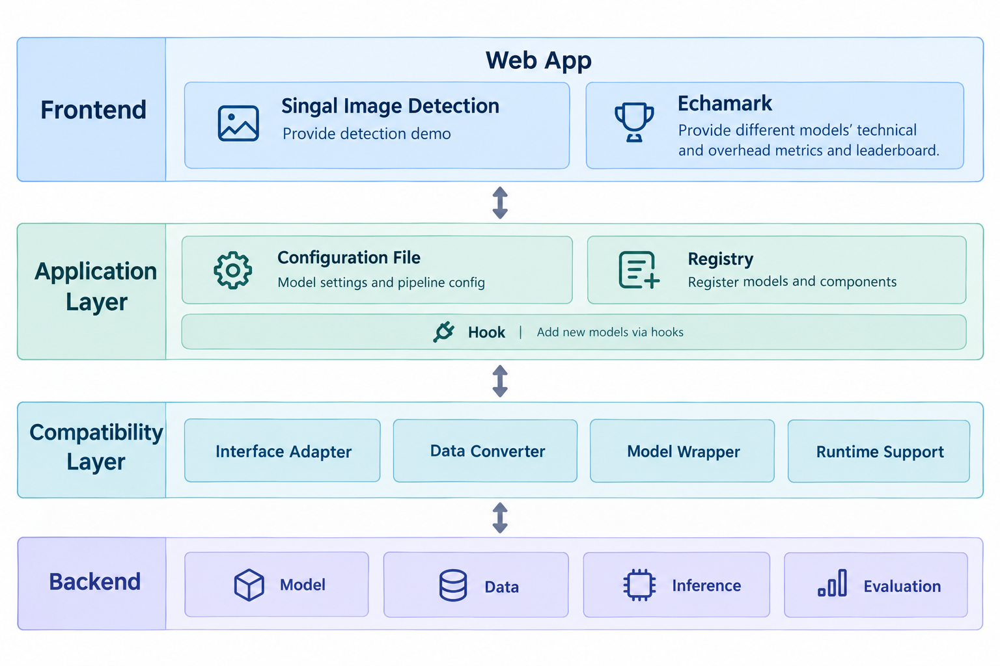
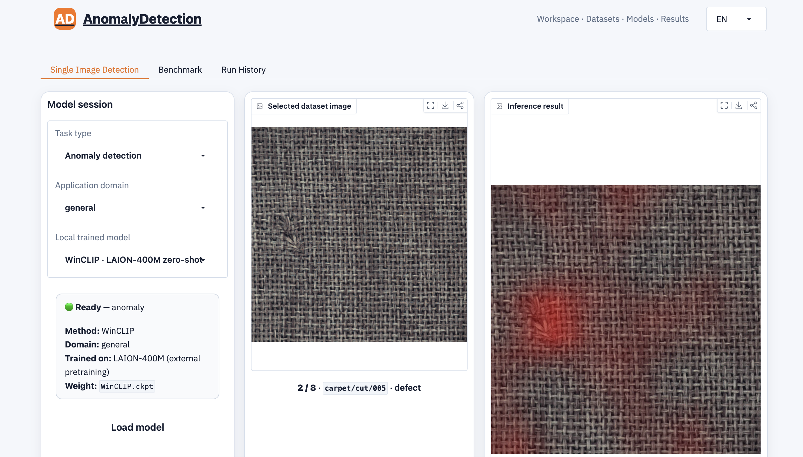
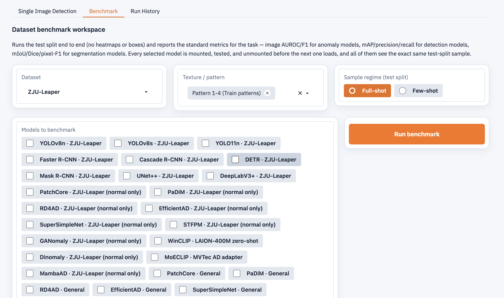
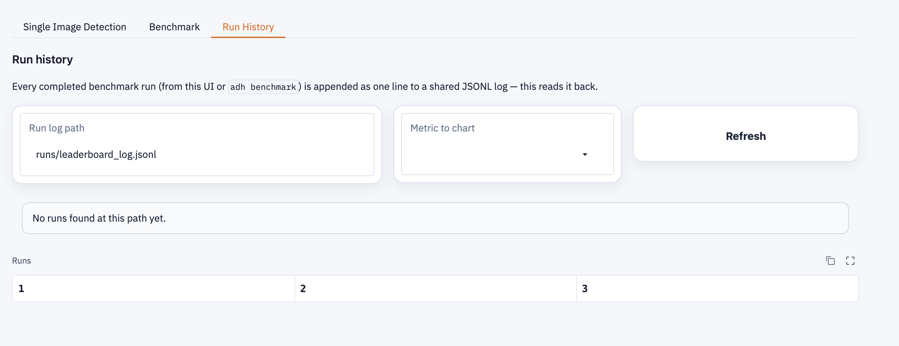
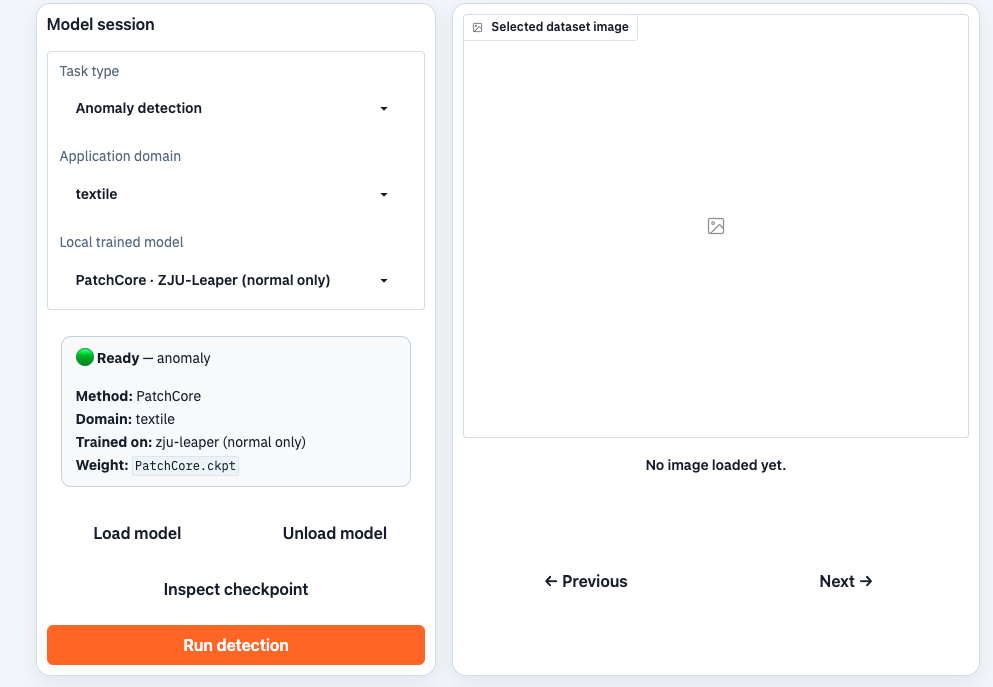
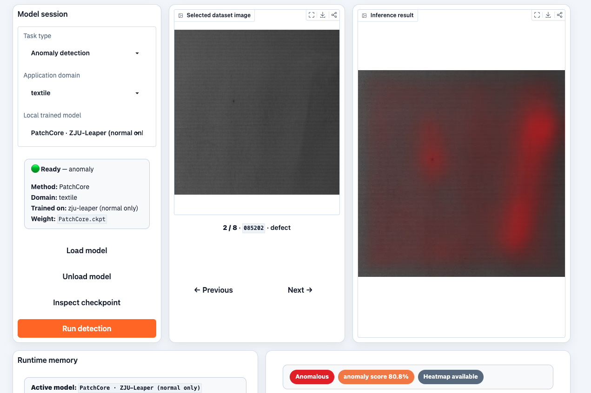

<h1 align="center">AnomalyDetection</h1>

> **TODO — work in progress.** This document is not finished: some reference values (measured
> runtimes, weight checksums, recorded-demo revisions) are still outstanding.

---

## Outline

<a href="#outline">Outline</a><br>
<a href="#1-introduction">1. Introduction</a><br>
<a href="#2-environment-setup">2. Environment Setup</a><br>
&nbsp;&nbsp;&nbsp;&nbsp;<a href="#21-requirements">2.1 Requirements</a><br>
&nbsp;&nbsp;&nbsp;&nbsp;&nbsp;&nbsp;&nbsp;&nbsp;<a href="#211-hardware-requirements">2.1.1 Hardware Requirements</a><br>
&nbsp;&nbsp;&nbsp;&nbsp;&nbsp;&nbsp;&nbsp;&nbsp;<a href="#212-software-requirements">2.1.2 Software Requirements</a><br>
&nbsp;&nbsp;&nbsp;&nbsp;<a href="#22-installation">2.2 Installation</a><br>
&nbsp;&nbsp;&nbsp;&nbsp;&nbsp;&nbsp;&nbsp;&nbsp;<a href="#221-clone-the-repository">2.2.1 Clone the Repository</a><br>
&nbsp;&nbsp;&nbsp;&nbsp;&nbsp;&nbsp;&nbsp;&nbsp;<a href="#222-install-python-environment">2.2.2 Install Python Environment</a><br>
&nbsp;&nbsp;&nbsp;&nbsp;&nbsp;&nbsp;&nbsp;&nbsp;<a href="#223-install-dependencies">2.2.3 Install Dependencies</a><br>
&nbsp;&nbsp;&nbsp;&nbsp;&nbsp;&nbsp;&nbsp;&nbsp;<a href="#224-verify-installation">2.2.4 Verify Installation</a><br>
&nbsp;&nbsp;&nbsp;&nbsp;&nbsp;&nbsp;&nbsp;&nbsp;<a href="#225-download-datasets">2.2.5 Download Datasets</a><br>
&nbsp;&nbsp;&nbsp;&nbsp;&nbsp;&nbsp;&nbsp;&nbsp;<a href="#226-download-checkpoints">2.2.6 Download Checkpoints</a><br>
&nbsp;&nbsp;&nbsp;&nbsp;&nbsp;&nbsp;&nbsp;&nbsp;<a href="#227-directory-layout">2.2.7 Directory layout</a><br>
<a href="#3-models-datasets-and-metrics">3. Models, Datasets, and Metrics</a><br>
&nbsp;&nbsp;&nbsp;&nbsp;<a href="#31-supported-models">3.1 Supported Models</a><br>
&nbsp;&nbsp;&nbsp;&nbsp;<a href="#32-supported-datasets">3.2 Supported Datasets</a><br>
&nbsp;&nbsp;&nbsp;&nbsp;<a href="#33-supported-metrics">3.3 Supported Metrics</a><br>
&nbsp;&nbsp;&nbsp;&nbsp;&nbsp;&nbsp;&nbsp;&nbsp;<a href="#331-technical-metrics-image-level">3.3.1 Technical Metrics: Image level</a><br>
&nbsp;&nbsp;&nbsp;&nbsp;&nbsp;&nbsp;&nbsp;&nbsp;<a href="#332-technical-metrics-pixel-level">3.3.2 Technical Metrics: Pixel level</a><br>
&nbsp;&nbsp;&nbsp;&nbsp;&nbsp;&nbsp;&nbsp;&nbsp;<a href="#333-technical-metrics-instance-level">3.3.3 Technical Metrics: Instance level</a><br>
&nbsp;&nbsp;&nbsp;&nbsp;&nbsp;&nbsp;&nbsp;&nbsp;<a href="#334-technical-metrics-cross-domain">3.3.4 Technical Metrics: Cross-domain</a><br>
&nbsp;&nbsp;&nbsp;&nbsp;&nbsp;&nbsp;&nbsp;&nbsp;<a href="#335-overhead-metrics-compute">3.3.5 Overhead Metrics: Compute</a><br>
&nbsp;&nbsp;&nbsp;&nbsp;&nbsp;&nbsp;&nbsp;&nbsp;<a href="#336-overhead-metrics-memory">3.3.6 Overhead Metrics: Memory</a><br>
<a href="#4-workflows">4. Workflows</a><br>
&nbsp;&nbsp;&nbsp;&nbsp;<a href="#41-web-front-end">4.1 Web front-end</a><br>
&nbsp;&nbsp;&nbsp;&nbsp;&nbsp;&nbsp;&nbsp;&nbsp;<a href="#411-start-the-web-front-end">4.1.1 Start the web front-end</a><br>
&nbsp;&nbsp;&nbsp;&nbsp;&nbsp;&nbsp;&nbsp;&nbsp;<a href="#412-image-anomaly-detection">4.1.2 Image Anomaly Detection</a><br>
&nbsp;&nbsp;&nbsp;&nbsp;&nbsp;&nbsp;&nbsp;&nbsp;<a href="#413-benchmarking">4.1.3 Benchmarking</a><br>
&nbsp;&nbsp;&nbsp;&nbsp;&nbsp;&nbsp;&nbsp;&nbsp;<a href="#414-read-benchmark-run-history">4.1.4 Read benchmark run history</a><br>
&nbsp;&nbsp;&nbsp;&nbsp;<a href="#42-the-backend-command-line-interface">4.2 The backend command line interface</a><br>
&nbsp;&nbsp;&nbsp;&nbsp;&nbsp;&nbsp;&nbsp;&nbsp;<a href="#421-model-configuration">4.2.1 Model Configuration</a><br>
&nbsp;&nbsp;&nbsp;&nbsp;&nbsp;&nbsp;&nbsp;&nbsp;<a href="#422-training">4.2.2 Training</a><br>
&nbsp;&nbsp;&nbsp;&nbsp;&nbsp;&nbsp;&nbsp;&nbsp;<a href="#423-inference">4.2.3 Inference</a><br>
&nbsp;&nbsp;&nbsp;&nbsp;&nbsp;&nbsp;&nbsp;&nbsp;<a href="#424-evaluation">4.2.4 Evaluation</a><br>
&nbsp;&nbsp;&nbsp;&nbsp;&nbsp;&nbsp;&nbsp;&nbsp;<a href="#425-benchmarking">4.2.5 Benchmarking</a><br>
&nbsp;&nbsp;&nbsp;&nbsp;&nbsp;&nbsp;&nbsp;&nbsp;<a href="#426-batch-training">4.2.6 Batch training</a><br>
&nbsp;&nbsp;&nbsp;&nbsp;&nbsp;&nbsp;&nbsp;&nbsp;<a href="#427-catalogue-and-diagnostic-commands">4.2.7 Catalogue and diagnostic commands</a><br>
<a href="#5-examples">5. Examples</a><br>
&nbsp;&nbsp;&nbsp;&nbsp;<a href="#51-start-the-web-front-end">5.1 Start the web front-end</a><br>
&nbsp;&nbsp;&nbsp;&nbsp;<a href="#52-run-anomaly-detection-example">5.2 Run Anomaly Detection Example</a><br>
<a href="#6-extensibility">6. Extensibility</a><br>
&nbsp;&nbsp;&nbsp;&nbsp;<a href="#61-example-add-a-dataset">6.1 Example: add a dataset</a><br>
&nbsp;&nbsp;&nbsp;&nbsp;<a href="#62-example-add-a-model-backend">6.2 Example: add a model backend</a><br>

## 1. Introduction

AnomalyDetection is an **extensible, multi-domain platform** that collects **18 classical methods**, multiple datasets for benchmarking, and a **Web front-end**.

Industrial inspection demands high-speed, high-accuracy anomaly detection. However, existing methods remain fragmented with disparate formats and lack joint assessments of accuracy and deployment cost. To address this, we present a unified benchmarking platform that integrates SOTA methods to systematically evaluate both predictive performance and computational overhead.

Throughout this document, a **benchmark** means scoring one or more models, on one dataset, under one configuration, and reading the outcome as the metrics of section 3.3. Section 3 is what can be measured; section 4 is how to run a measurement.

## 2. Environment Setup

### 2.1 Requirements

#### 2.1.1 Hardware Requirements

<table align="center">
  <thead>
    <tr>
      <th>Workflow</th>
      <th>CPU / RAM</th>
      <th>GPU</th>
      <th>Disk Requirements</th>
    </tr>
  </thead>
  <tbody>
    <tr>
      <td>Web front-end</td>
      <td>8 cores, 16 GB</td>
      <td>Optional</td>
      <td>At least 10 GB (depends on downloaded checkpoints and datasets)</td>
    </tr>
    <tr>
      <td>Full Training</td>
      <td>16 cores, 32 GB</td>
      <td>NVIDIA recommended</td>
      <td>40 GB (Full dataset) + 5 GB (Checkpoints)</td>
    </tr>
    <tr>
      <td>Full Benchmarking</td>
      <td>16 cores, 32 GB</td>
      <td>Recommended</td>
      <td>At least 50 GB (Scales with tested checkpoints and evaluated datasets)</td>
    </tr>
  </tbody>
</table>

#### 2.1.2 Software Requirements

<table align="center">
  <thead>
    <tr>
      <th>Item</th>
      <th>Requirement</th>
    </tr>
  </thead>
  <tbody>
    <tr><td><strong>Python</strong></td><td><code>≥3.10</code></td></tr>
    <tr><td><strong>Environment manager</strong></td><td>Conda</td></tr>
    <tr><td><strong>Operating system</strong></td><td>Linux, Windows, macOS</td></tr>
    <tr><td><strong>GPU</strong></td><td>optional for inference; NVIDIA/CUDA for training</td></tr>
    <tr><td><strong>CUDA</strong></td><td>only for NVIDIA acceleration</td></tr>

  </tbody>
</table>

### 2.2 Installation

#### 2.2.1 Clone the Repository

```bash
git clone --recurse-submodules https://github.com/LINC-BIT/AnomalyDetection.git
cd AnomalyDetection
```

Do not clone submodules manually. If submodule initialization fails or is executed incorrectly, re-run `git submodule update --init --recursive` to restore the submodules.

If a component checkout turns out to be missing, restore it and check what landed: `git submodule update --init --recursive`, then `git submodule status`, then `adh doctor`.

#### 2.2.2 Install Python Environment

Create and activate the Python environment:

```bash
conda create -n anomalib_env python=3.12 -y
conda activate anomalib_env
python --version
```

#### 2.2.3 Install Dependencies

Choose the scenario according to the deployment; **Full** is recommended.

<table align="center">
  <thead>
    <tr>
      <th>Scenario</th>
      <th>Installation command</th>
    </tr>
  </thead>
  <tbody>
    <tr><td>Full</td><td><code>python -m pip install -e ".[all]"</code></td></tr>
    <tr><td>Frontend</td><td><code>python -m pip install -e ".[ui]"</code></td></tr>
    <tr><td>Training</td><td><code>python -m pip install -e ".[train]"</code></td></tr>
    <tr><td>Evaluation</td><td><code>python -m pip install -e ".[eval]"</code></td></tr>
  </tbody>
</table>

If importing the web interface raises a SOCKS proxy error, install the root requirements file, which provides `httpx[socks]`: `python -m pip install -r requirements.txt`.

#### 2.2.4 Verify Installation

Use the following commands to verify the installation, no dataset and no weight is required:

```bash
adh doctor
adh list
```

Example output of `adh doctor` (one entry per backend, runnable backends first):

```json
{
  "backends": {
    "anomalib": {
      "framework_installed": true,
      "dataset_kind": "one-class",
      "dataset": "fabric-defects",
      "trainable_now": true,
      "reason": "No dataset was requested; picked 'fabric-defects' (staged). Other staged alternatives: fabric-train, mvtec-ad, mvtec-loco, raw-fabric, tianchi, tilda-400, visa, zju-leaper."
    },
    "dinomaly": {
      "framework_installed": true,
      "dataset_kind": "one-class",
      "dataset": "fabric-defects",
      "trainable_now": true,
      "reason": "No dataset was requested; picked 'fabric-defects' (staged). Other staged alternatives: fabric-train, mvtec-ad, mvtec-loco, raw-fabric, tianchi, tilda-400, visa, zju-leaper."
    }
  }
}
```

`trainable_now` is true when the backend's framework is installed *and* a suitable dataset is staged; `reason` names the dataset that would be picked and the staged alternatives. Both depend on the local machine, so a different host prints different values.

```json
{
  "datasets": ["fabric-defects", "fabric-train", "mvtec-ad", "mvtec-loco", "raw-fabric", "tianchi", "tilda-400", "visa", "zju-leaper"],
  "model_backends": {
    "known": ["anomalib", "dinomaly", "mambaad", "moeclip", "torchvision", "ultralytics"],
    "available": ["anomalib", "dinomaly", "mambaad", "moeclip", "torchvision", "ultralytics"]
  },
  "evaluators": ["anomaly", "detection", "industrial", "segmentation"],
  "profilers": ["onnxruntime", "pytorch", "tensorrt"]
}
```

`known` lists every supported backend; `available` lists the ones importable on this machine, so it is a subset of `known` whenever an optional framework is not installed.

Other catalogue and diagnostic commands work the same way:
- `adh inventory` prints the machine-readable model and dataset inventory, 
- `adh models` lists the model variants of each backend, 
- `adh recipes` lists the registered optimization recipes,
- `adh train --list` lists the model configurations a training run can resolve.

#### 2.2.5 Download Datasets

Three of the registered datasets have an automated download; the rest are staged by hand. Both routes end at the same place: a dataset is available once its **declared root** exists, is not empty, and is spelled exactly as declared. Run the download from the repository root.

**Automated download.** The tool takes the registered dataset identifier and the declared root:

<table align="center">
  <thead>
    <tr>
      <th>Dataset</th>
      <th>Download command</th>
    </tr>
  </thead>
  <tbody>
    <tr><td>MVTec AD</td><td><code>python tools/download_datasets.py mvtec-ad --root "datasets/general/MVTec AD"</code></td></tr>
    <tr><td>VisA</td><td><code>python tools/download_datasets.py visa --root datasets/general/VisA</code></td></tr>
    <tr><td>ZJU-Leaper</td><td><code>python tools/download_datasets.py zju-leaper --root datasets/textile/ZJU-Leaper</code></td></tr>
  </tbody>
</table>

Without further flags each of these downloads the whole dataset. Three details decide whether it lands where the platform looks for it:

- `--category <name>` fetches a single category, for MVTec AD and VisA only.
- Category names are the dataset's own — `bottle`, `cable`, `capsule`, … for MVTec AD; `candle`, `capsules`, `pcb1`, … for VisA. Each dataset's page lists them: [MVTec AD](https://www.mvtec.com/company/research/datasets/mvtec-ad), [VisA](https://github.com/amazon-science/spot-diff), [ZJU-Leaper](https://huggingface.co/datasets/AnupamaBandara/ZLU_Leaper).
- Pass the root exactly as written above. For MVTec AD that includes the space in `MVTec AD`; any other spelling is outside the registered root and `adh doctor` reports the dataset as not staged.

ZJU-Leaper has no categories to select: it is divided into patterns, which selection uses through `--pattern` at run time, not at download time.

**Manual staging.** These five have no automated download:

- MVTec LOCO
- RAW-FABRID
- TILDA-400
- Fabric Defects Dataset
- Tianchi

Stage each one with the same three steps: create its declared root, copy the extracted dataset into it, then confirm it is picked up.

```bash
mkdir -p "datasets/general/MVTec LOCO"
# Copy the extracted dataset into that directory.
adh doctor
```

Each adapter documents its expected layout in its module docstring, under `src/fabric_defect_hub/datasets/`. To point one command at a copy staged elsewhere, pass `--dataset-root`.

**Verify the data.** `adh doctor` decides on mere presence: a non-empty directory at the declared root is "staged". An empty folder therefore does not count, but a partial download does, so check the staged copy against these counts:

<table align="center">
  <thead>
    <tr>
      <th>Dataset identifier</th>
      <th>Unit</th>
      <th>Expected count</th>
    </tr>
  </thead>
  <tbody>
    <tr><td><code>mvtec-ad</code></td><td>categories</td><td>15</td></tr>
    <tr><td><code>mvtec-loco</code></td><td>categories</td><td>5</td></tr>
    <tr><td><code>visa</code></td><td>categories</td><td>12</td></tr>
    <tr><td><code>zju-leaper</code></td><td>patterns</td><td>19</td></tr>
  </tbody>
</table>

When a dataset is reported as unavailable, find its declared root below, check the directory is complete, and point one command at another copy with `--dataset-root` if it is staged elsewhere.

Identifier, name shown in the web front-end, and declared root for every registered dataset:

<table align="center">
  <thead>
    <tr>
      <th>Identifier</th>
      <th>Name in the web front-end</th>
      <th>Declared root</th>
    </tr>
  </thead>
  <tbody>
    <tr><td><code>zju-leaper</code></td><td>ZJU-Leaper</td><td><code>datasets/textile/ZJU-Leaper</code></td></tr>
    <tr><td><code>raw-fabric</code></td><td>RAW-FABRID</td><td><code>datasets/textile/RAW_FABRID</code></td></tr>
    <tr><td><code>tilda-400</code></td><td>TILDA-400</td><td><code>datasets/textile/TILDA_400</code></td></tr>
    <tr><td><code>fabric-defects</code></td><td>Fabric Defects</td><td><code>datasets/textile/Fabric Defects Dataset</code></td></tr>
    <tr><td><code>tianchi</code></td><td>Tianchi</td><td><code>datasets/textile/tianchi</code></td></tr>
    <tr><td><code>fabric-train</code></td><td>—</td><td><code>datasets/textile</code></td></tr>
    <tr><td><code>mvtec-ad</code></td><td>MVTec AD</td><td><code>datasets/general/MVTec AD</code></td></tr>
    <tr><td><code>mvtec-loco</code></td><td>MVTec LOCO</td><td><code>datasets/general/MVTec LOCO</code></td></tr>
    <tr><td><code>visa</code></td><td>VisA</td><td><code>datasets/general/VisA</code></td></tr>
  </tbody>
</table>

`fabric-train` is a composite: it has a root but no data of its own, and it is not listed in the web front-end's dataset dropdown.

#### 2.2.6 Download Checkpoints

We provide pretrained checkpoints for demonstration:

- **Textile domain** — the detectors `yolov8n`, `yolov8s`, `yolo11n`, `fasterrcnn_resnet50_fpn`, `cascadercnn_resnet50_fpn`, and `detr_resnet50`; the segmentation models `maskrcnn_resnet50_fpn`, `unetplusplus_resnet34`, and `deeplabv3plus_resnet50`; and the normal-only anomaly models `PatchCore`, `PaDiM`, `RD4AD`, `EfficientAD`, `SuperSimpleNet`, `STFPM`, `GANomaly`, and `Dinomaly`.
- **General domain** — the zero-shot `WinCLIP` and the auxiliary-trained `MoECLIP`.


**Step 1: Install the Hugging Face Hub client:**

```bash
python -m pip install -U huggingface_hub
```

**Step 2: Download the checkpoints:**

Download all checkpoints:

```bash
python tools/download_weights.py --all
```

Optional: To download a single checkpoint, browse the [published checkpoints on Hugging Face](https://huggingface.co/AuroraLeeeeee/AnomalyDetection-textile-weights) and pick the one needed, for example:

```bash
python tools/download_weights.py \
  textile/artifacts/models/published/yolov8n.pt \
  --output textile/artifacts/models/published/yolov8n.pt
```

If a weight turns out to be missing, `adh inventory` reports its `weight` and `weight_status`. Place the weight at the path it reports. Never rename a weight of a different architecture: download the one the manifest names, or train it.

#### 2.2.7 Directory layout

Run every command in this README from the repository root. The paths it prints and accepts are relative to that directory.

```text
AnomalyDetection/
├── src/fabric_defect_hub/          # the platform: datasets, model backends, evaluation, CLI, web interface
├── configs/
│   ├── registry/models.yaml        # the model manifest: what is published, and where each weight lives
│   ├── models/                     # model configurations (textile)
│   └── training_profile.yaml       # shared training profile
├── datasets/
│   ├── textile/                    # ZJU-Leaper, RAW-FABRID, TILDA-400, Fabric Defects Dataset, tianchi
│   └── general/                    # MVTec AD, MVTec LOCO, VisA
├── textile/  and  general/         # one directory per application domain
│   ├── configs/models/             # model configurations (general)
│   └── artifacts/models/published/ # published weights, one file per model identifier
├── artifacts/                      # written by runs
│   ├── models/                     # trained weights, the weight manifest, per-run config records
│   ├── benchmarks/                 # benchmark results
│   └── runtime/anomaly_maps/       # saved anomaly maps
├── results/                        # JSON written by `--output`
├── runs/                           # the append-only run log, plus training run output
├── tools/                          # download, export, and benchmark scripts
└── docs/                           # focused guides, figures, and the recorded demonstrations
```

Two conventions explain most of the paths used later:

- A dataset counts as staged when its **declared root** exists, is not empty, and is spelled exactly as declared (`datasets/textile/ZJU-Leaper`, `datasets/general/MVTec AD`). `adh doctor` reports what it finds.
- The web front-end and the CLI read the **same** tree, so anything a run produces under `artifacts/` is what the front-end then serves.

## 3. Models, Datasets, and Metrics

### 3.1 Supported Models

18 methods are supported.

<table align="center">
  <thead>
    <tr>
      <th>Method</th>
      <th>Task Type</th>
      <th>Output</th>
      <th>Learning Type</th>
    </tr>
  </thead>
  <tbody>
    <tr><td>YOLO</td><td>Defect detection</td><td>Bounding boxes</td><td>Supervised</td></tr>
    <tr><td>Faster R-CNN</td><td>Defect detection</td><td>Bounding boxes</td><td>Supervised</td></tr>
    <tr><td>Cascade R-CNN</td><td>Defect detection</td><td>Bounding boxes</td><td>Supervised</td></tr>
    <tr><td>DETR</td><td>Defect detection</td><td>Bounding boxes</td><td>Supervised</td></tr>
    <tr><td>Mask R-CNN</td><td>Defect detection</td><td>Bounding boxes, pixel-level segmentation</td><td>Supervised</td></tr>
    <tr><td>UNet++</td><td>Defect detection</td><td>Pixel-level segmentation</td><td>Supervised</td></tr>
    <tr><td>DeepLabV3+</td><td>Defect detection</td><td>Pixel-level segmentation</td><td>Supervised</td></tr>
    <tr><td>PatchCore</td><td>Anomaly detection</td><td>Image-level score, pixel-level heat map</td><td>Normal-only (one-class)</td></tr>
    <tr><td>PaDiM</td><td>Anomaly detection</td><td>Image-level score, pixel-level heat map</td><td>Normal-only (one-class)</td></tr>
    <tr><td>Reverse Distillation</td><td>Anomaly detection</td><td>Image-level score, pixel-level heat map</td><td>Normal-only (one-class)</td></tr>
    <tr><td>EfficientAD</td><td>Anomaly detection</td><td>Image-level score, pixel-level heat map</td><td>Normal-only (one-class)</td></tr>
    <tr><td>SuperSimpleNet</td><td>Anomaly detection</td><td>Image-level score, pixel-level heat map</td><td>Normal-only (one-class)</td></tr>
    <tr><td>STFPM</td><td>Anomaly detection</td><td>Image-level score, pixel-level heat map</td><td>Normal-only (one-class)</td></tr>
    <tr><td>GANomaly</td><td>Anomaly detection</td><td>Image-level score</td><td>Normal-only (one-class)</td></tr>
    <tr><td>Dinomaly</td><td>Anomaly detection</td><td>Image-level score, pixel-level heat map</td><td>Normal-only (one-class)</td></tr>
    <tr><td>MambaAD</td><td>Anomaly detection</td><td>Image-level score, pixel-level heat map</td><td>Normal-only (one-class)</td></tr>
    <tr><td>WinCLIP</td><td>Anomaly detection</td><td>Image-level score, pixel-level heat map</td><td>Zero-shot</td></tr>
    <tr><td>MoECLIP</td><td>Anomaly detection</td><td>Image-level score, pixel-level heat map</td><td>Supervised (zero-shot transfer)</td></tr>
  </tbody>
</table>

### 3.2 Supported Datasets

Nine datasets are registered.

<table align="center">
  <thead>
    <tr>
      <th>Name</th>
      <th>Domain</th>
      <th>Images</th>
      <th>Categories</th>
      <th>Annotation</th>
    </tr>
  </thead>
  <tbody>
    <tr><td>ZJU-Leaper</td><td>Fabric</td><td>94,833</td><td>19 patterns (5 groups)</td><td>Bounding boxes, pixel-level masks</td></tr>
    <tr><td>RAW-FABRID</td><td>Fabric</td><td>19,852 tiles (709 raw images)</td><td>1 defect bucket</td><td>Pixel-level masks</td></tr>
    <tr><td>TILDA-400</td><td>Fabric</td><td>25,600</td><td>4 defect types</td><td>Image-level label</td></tr>
    <tr><td>Fabric Defects Dataset</td><td>Fabric</td><td>2,430</td><td>5 defect types</td><td>Pixel-level masks</td></tr>
    <tr><td>Tianchi Fabric Defect</td><td>Fabric</td><td>9,576</td><td>34 defect types</td><td>Bounding boxes</td></tr>
    <tr><td>Fabric-Train (composite)</td><td>Fabric</td><td>97,459 (its 5 members' train splits combined)</td><td>5 fabric datasets combined</td><td>Bounding boxes, pixel-level masks</td></tr>
    <tr><td>MVTec AD</td><td>Industrial objects</td><td>5,354</td><td>15 categories</td><td>Pixel-level masks</td></tr>
    <tr><td>MVTec LOCO AD</td><td>Everyday objects</td><td>3,346</td><td>5 categories</td><td>Pixel-level masks</td></tr>
    <tr><td>VisA</td><td>General objects</td><td>10,821</td><td>12 categories</td><td>Pixel-level masks</td></tr>
  </tbody>
</table>

Image and category counts are measured from the staged copy under `datasets/`; `Annotation` is what the dataset's adapter exposes.

Except for the composite, a count is the train split plus the test split as the adapter loads them. `Fabric-Train` is its members' train splits, being a training corpus.

### 3.3 Supported Metrics

Metrics are divided into two parts. 
- **technical** metrics evaluate model accuracy across different levels.
- **overhead** metrics evaluate the  running cost of the model.

The following table summarizes the supported metrics for each category and scope. These tables are the vocabulary of a benchmark result:

- a benchmark reports its numbers under exactly these headings, one table per scope;
- a metric the model's capability declaration cannot produce leaves that cell empty, rather than reporting a zero.

<table align="center">
  <thead>
    <tr>
      <th>Category</th>
      <th>Table</th>
      <th>Scope</th>
      <th>Metrics</th>
    </tr>
  </thead>
  <tbody>
    <tr><td>Technical</td><td>Image level</td><td>The image as a whole</td><td>7</td></tr>
    <tr><td>Technical</td><td>Pixel level</td><td>Every pixel of the image</td><td>7</td></tr>
    <tr><td>Technical</td><td>Instance level</td><td>Each detected defect, as a box</td><td>20</td></tr>
    <tr><td>Technical</td><td>Cross-domain</td><td>The same weights on an unseen fabric</td><td>8</td></tr>
    <tr><td>Overhead</td><td>Compute</td><td>Time, FPS, latency, FLOPs, energy, transfer size</td><td>26</td></tr>
    <tr><td>Overhead</td><td>Memory</td><td>Peak and average memory, model size, parameters</td><td>4</td></tr>
    <tr><td>Overhead</td><td>Communication</td><td>Bandwidth saved over a deployed link; declared but not implemented</td><td>—</td></tr>
  </tbody>
</table>

The communication metric is currently set to incomplete as it requires an active transport to measure.

#### 3.3.1 Technical Metrics: Image level

Evaluates the image as a whole.

<table align="center">
  <thead>
    <tr>
      <th>Metric</th>
      <th>Meaning</th>
    </tr>
  </thead>
  <tbody>
    <tr><td>Image AUROC</td><td>Ranking quality of the image-level anomaly score.</td></tr>
    <tr><td>Image F1</td><td>F1 of the thresholded image decision.</td></tr>
    <tr><td>Image Precision</td><td>Share of the images called defective that are defective.</td></tr>
    <tr><td>Image Recall</td><td>Share of the defective images that are called.</td></tr>
    <tr><td>Decision threshold</td><td>The threshold the decision was taken at. It is calibrated on a validation set.</td></tr>
    <tr><td>AUROC</td><td>The unprefixed AUROC key some runs record for the same curve.</td></tr>
    <tr><td>AP</td><td>Average precision of the same image-level ranking.</td></tr>
  </tbody>
</table>

#### 3.3.2 Technical Metrics: Pixel level

Evaluates the classification result of every pixel.

<table align="center">
  <thead>
    <tr>
      <th>Metric</th>
      <th>Meaning</th>
    </tr>
  </thead>
  <tbody>
    <tr><td>Pixel AUROC</td><td>Ranking quality over individual pixels, defective vs normal.</td></tr>
    <tr><td>AUPRO</td><td>Area under the per-region overlap curve, capped at a maximum false-positive rate.</td></tr>
    <tr><td>IAP</td><td>Instance Average Precision: each connected defect region gets its own precision/recall integral, and the regions are averaged with equal weight.</td></tr>
    <tr><td>Pixel F1</td><td>F1 over pixels at the calibrated pixel threshold.</td></tr>
    <tr><td>mIoU</td><td>Mean intersection-over-union of predicted and ground-truth masks (segmentation).</td></tr>
    <tr><td>Dice</td><td>Dice coefficient of predicted and ground-truth masks.</td></tr>
    <tr><td>PRO score</td><td>Per-region overlap up to a maximum false-positive rate; strict on microscopic and connected defect regions.</td></tr>
  </tbody>
</table>

#### 3.3.3 Technical Metrics: Instance level

Evaluates each detected defect as a bounding box.

<table align="center">
  <thead>
    <tr>
      <th>Metric</th>
      <th>Meaning</th>
    </tr>
  </thead>
  <tbody>
    <tr><td>mAP@[.5:.95]</td><td>Mean average precision averaged over IoU thresholds 0.5 to 0.95 (COCO style).</td></tr>
    <tr><td>mAP@0.5</td><td>mAP at IoU 0.5.</td></tr>
    <tr><td>mAP@0.75</td><td>mAP at IoU 0.75.</td></tr>
    <tr><td>mAP small</td><td>mAP restricted to small boxes.</td></tr>
    <tr><td>mAP medium</td><td>mAP restricted to medium boxes.</td></tr>
    <tr><td>mAP large</td><td>mAP restricted to large boxes.</td></tr>
    <tr><td>mAR@1</td><td>Mean average recall with one detection per image.</td></tr>
    <tr><td>mAR@10</td><td>Mean average recall with ten detections per image.</td></tr>
    <tr><td>mAR@100</td><td>Mean average recall with a hundred detections per image.</td></tr>
    <tr><td>mAR small</td><td>mAR restricted to small boxes.</td></tr>
    <tr><td>mAR medium</td><td>mAR restricted to medium boxes.</td></tr>
    <tr><td>mAR large</td><td>mAR restricted to large boxes.</td></tr>
    <tr><td>Precision @0.5</td><td>Precision of the thresholded detections at IoU 0.5.</td></tr>
    <tr><td>Recall @0.5</td><td>Recall of the thresholded detections at IoU 0.5.</td></tr>
    <tr><td>F1 @0.5</td><td>F1 of the thresholded detections at IoU 0.5.</td></tr>
    <tr><td>Recall (small &lt;10px)</td><td>Recall on boxes whose shorter side is under 10 px. These are the broken-warp / skipped-pick cases an aggregate recall averages away.</td></tr>
    <tr><td>Recall (normal)</td><td>Recall on the remaining, larger boxes.</td></tr>
    <tr><td>TP</td><td>True positives behind the thresholded numbers.</td></tr>
    <tr><td>FP</td><td>False positives behind the thresholded numbers.</td></tr>
    <tr><td>FN</td><td>False negatives behind the thresholded numbers.</td></tr>
  </tbody>
</table>

#### 3.3.4 Technical Metrics: Cross-domain

Evaluates the same weights on fabrics they were not trained on.

<table align="center">
  <thead>
    <tr>
      <th>Metric</th>
      <th>Meaning</th>
    </tr>
  </thead>
  <tbody>
    <tr><td>Source accuracy</td><td>Accuracy on the patterns the model was trained on.</td></tr>
    <tr><td>Cross-domain drop</td><td>Accuracy drop, in percent, on a single held-out dataset.</td></tr>
    <tr><td>Top-k mean drop</td><td>Mean drop over the k worst (or best) held-out patterns.</td></tr>
    <tr><td>Mean drop (all patterns)</td><td>Mean drop over every held-out pattern that could be scored.</td></tr>
    <tr><td>CI low</td><td>Lower bound of the bootstrap confidence interval, resampling patterns rather than images.</td></tr>
    <tr><td>CI high</td><td>Upper bound of the same interval.</td></tr>
    <tr><td>k used</td><td>How many patterns the top-k mean actually used.</td></tr>
    <tr><td>Patterns scored</td><td>How many held-out patterns were scorable. Unscorable patterns are skipped, never counted as zero degradation.</td></tr>
  </tbody>
</table>

#### 3.3.5 Overhead Metrics: Compute

What running it costs in time, work and power.

<table align="center">
  <thead>
    <tr>
      <th>Metric</th>
      <th>Meaning</th>
    </tr>
  </thead>
  <tbody>
    <tr><td>FPS (aggregate)</td><td>Frames per second over the profiling pass.</td></tr>
    <tr><td>Instantaneous FPS mean</td><td>Mean of the per-frame instantaneous frame rate.</td></tr>
    <tr><td>Instantaneous FPS stdev</td><td>Spread of the instantaneous frame rate.</td></tr>
    <tr><td>Instantaneous FPS CV</td><td>Coefficient of variation of the instantaneous frame rate: frame-rate jitter.</td></tr>
    <tr><td>Latency mean</td><td>Mean per-frame latency, in milliseconds.</td></tr>
    <tr><td>Latency stdev</td><td>Spread of the per-frame latency.</td></tr>
    <tr><td>Latency CV</td><td>Coefficient of variation of the per-frame latency.</td></tr>
    <tr><td>Latency p50</td><td>Median per-frame latency.</td></tr>
    <tr><td>Latency p95</td><td>95th percentile per-frame latency.</td></tr>
    <tr><td>Latency p99</td><td>99th percentile per-frame latency.</td></tr>
    <tr><td>FLOPs</td><td>Multiply-accumulates of one forward pass.</td></tr>
    <tr><td>FLOPs (G)</td><td>The same in giga-FLOPs.</td></tr>
    <tr><td>LMEI</td><td>Latency–Memory Efficiency Index: throughput divided by the log-scaled cost of FLOPs and VRAM. Higher is a better edge-deployment trade-off.</td></tr>
    <tr><td>Max streams @budget</td><td>Most concurrent streams that still meet the per-frame latency budget; the worst stream decides.</td></tr>
    <tr><td>1-stream latency</td><td>Latency at a single stream: the baseline the concurrency probe compares against.</td></tr>
    <tr><td>Throughput-resolution slope</td><td>How quickly throughput decays as input resolution grows.</td></tr>
    <tr><td>Slope difference</td><td>Difference between two runs' resolution slopes.</td></tr>
    <tr><td>Power mean</td><td>Mean power draw. NVML only, so NVIDIA hosts only.</td></tr>
    <tr><td>Power peak</td><td>Peak power draw.</td></tr>
    <tr><td>Energy</td><td>Energy used over the pass, in joules.</td></tr>
    <tr><td>Wall time</td><td>Wall-clock seconds of the scored run.</td></tr>
    <tr><td>Power samples</td><td>How many power readings the mean and peak are based on.</td></tr>
    <tr><td>Model transfer (MB)</td><td>Size of the model file, recorded as the communication proxy.</td></tr>
    <tr><td>Model transfer (bytes)</td><td>The same in bytes.</td></tr>
    <tr><td>Export transfer (MB)</td><td>Size of the exported artifact, recorded as the communication proxy.</td></tr>
    <tr><td>Export transfer (bytes)</td><td>The same in bytes.</td></tr>
  </tbody>
</table>

#### 3.3.6 Overhead Metrics: Memory

<table align="center">
  <thead>
    <tr>
      <th>Metric</th>
      <th>Meaning</th>
    </tr>
  </thead>
  <tbody>
    <tr><td>Parameters (M)</td><td>Parameter count, in millions.</td></tr>
    <tr><td>Memory peak</td><td>Peak memory during the profiling pass.</td></tr>
    <tr><td>Memory average</td><td>Average memory during the profiling pass.</td></tr>
    <tr><td>Model size</td><td>Size of the trained artifact on disk.</td></tr>
  </tbody>
</table>

## 4. Workflows

<p align="center"></p>

The platform consists of a **web front-end** and a **backend**:

* **Web front-end:** provides visual anomaly detection demos and a benchmarking platform for evaluating and comparing different models.
* **Backend:** provides model training, inference, dataset management, and model integration services.


### 4.1 Web front-end

The web front-end provides a unified interface for model demonstration and evaluation. The homepage is shown below:

<p align="center"></p>

The homepage contains three tabs: **Single Image Detection**, **Benchmark**, and **Run History**.

#### 4.1.1 Start the web front-end

```bash
cd <AnomalyDetection directory>
conda activate anomalib_env
adh-ui
```

Default URL `http://127.0.0.1:6008`, listening on all interfaces; please open the web browser to this address.

if the default port has been occupied, please set a different port using the `GRADIO_SERVER_PORT` environment variable, for example:

```bash
GRADIO_SERVER_PORT=7860 adh-ui
```

If the launch stops because the port is already in use, `adh-ui` names the process holding it and prints the three ways out:

- open the instance already running there;
- stop that process;
- move to another port with `GRADIO_SERVER_PORT`.

The manifest is read at process start, so an interface showing an obsolete label needs a restart of `adh-ui` to pick the change up.

#### 4.1.2 Image Anomaly Detection

To complete **Image Anomaly Detection**, follow these step-by-step instructions after the webpage loads:

**Phase 1: Model Setup**

* **Task type:** Select `Anomaly detection` (or `Defect detection` if required).
* **Application domain:** Select `general` (or `textile`).
* **Model:** Select a model from the available options, for example:
`WinCLIP · LAION-400M zero-shot`.
* **Load Model:** Click **Load model** before proceeding to inference.

> *Once loaded, the panel will display the **method**, **training corpus**, **training split**, and **prediction fields**.*

**Phase 2: Dataset & Sample Selection**

* **Data Source:** Choose your input using the following parameter options:
* **Dataset:** Select one available dataset, for example: `ZJU-Leaper`.
* **Texture / pattern:** Select `All textures` (or a specific pattern).
* **Split:** Select `test`.
* **Sample regime:** Choose your few-shot control based on the table below:

<table align="center" style="margin-left: auto; margin-right: auto; text-align: center;">
  <thead>
    <tr>
      <th style="text-align: center;">Regime</th>
      <th style="text-align: center;">What it loads</th>
    </tr>
  </thead>
  <tbody>
    <tr>
      <td style="text-align: center;"><b>Full-shot</b></td>
      <td style="text-align: center;">The whole selected slice</td>
    </tr>
    <tr>
      <td style="text-align: center;"><b>Few-shot</b></td>
      <td style="text-align: center;">A small number of random images from that slice</td>
    </tr>
  </tbody>
</table>

**Phase 3: Run Detection**

- **Load Images:** Click **Load random images** to populate the display (draws 4–12 random images from the selected slice).
- **Run Detection:** Click **Run detection** to execute inference.


**Expected Output**

Upon completion, the system returns an image gallery featuring:

* A calculated **per-image anomaly score**.
* A visual **heat map** (if supported by the selected model).

If no heat map appears, the model's capability declaration has no `anomaly_map` field:

- `GANomaly` scores the distance between two latent vectors, so it is image-level only;
- over a dataset, pixel-level metrics need that same map, so they are reported only for a model that produces one, and only when an output directory is supplied to persist it.

#### 4.1.3 Benchmarking

This is the module that produces the benchmark defined at the start of section 3: it scores the selected models on one dataset under one configuration and reports the metrics of section 3.3. The user interface is shown below:

<p align="center"></p>

Please follow the steps below to perform benchmarking:

-  **Configure Dataset and Sampling Parameters:** Select the **Dataset**, **Texture / pattern**, and **Sample regime (test split)** you wish to test.
- **Select Models and Metrics:** Check the model(s) to be evaluated and select your desired evaluation metrics.
- **Configure Advanced Options (Optional):** Check **Include profiling**, **Include resolution sweep**, or select a **Cross-domain degradation target dataset** as needed.
- **Run Benchmark:** Once all settings are configured, click **Run benchmark** and wait for the system to generate results.

Check the Results:

* Results are grouped by the metric tables of [3.3 Supported Metrics](#33-supported-metrics). A table that no selected model can fill is shown as `empty` with the reason, and the declared-but-unbuilt one as `not_implemented`; neither is reported as a zero.
* Every benchmark run appends a record to `runs/leaderboard_log.jsonl`, and generated anomaly maps are saved to `artifacts/runtime/anomaly_maps/benchmark/`.

#### 4.1.4 Read benchmark run history

This page displays the history of benchmark runs, allowing users to review past performance and results:

<p align="center"></p>

If prior benchmark run logs are available, you can load and visualize historical performance records using the following steps:

- **Select Metric:** Choose your target evaluation metric from the **Metric to Chart** dropdown menu.
- **Refresh Visualization:** Click **Refresh** to render the historical chart and performance records.

### 4.2 The backend command line interface

#### 4.2.1 Model Configuration

`train`, `predict`, and `evaluate` resolve their first positional argument three ways:

1. As a path to a model configuration, for example `configs/models/ultralytics_example.yaml`.
2. As a filename stem under `--config-dir`, for example `ultralytics_example`.
3. As a model keyword matched against the `model.variant` or `model.name` field of every model configuration under `--config-dir`, for example `yolov8n` or `patchcore`.

`--config-dir` defaults to `configs/models`. These commands list different objects:

<table align="center">
  <thead>
    <tr>
      <th>Command</th>
      <th>Lists</th>
    </tr>
  </thead>
  <tbody>
    <tr><td><code>adh train --list</code></td><td>the model configurations under <code>--config-dir</code></td></tr>
    <tr><td><code>adh recipes</code></td><td>registered optimization recipes, with paper reference and hyperparameters</td></tr>
    <tr><td><code>adh models</code></td><td>model variants per backend — not the published models, which are <code>adh inventory</code></td></tr>
  </tbody>
</table>

#### 4.2.2 Training

A training run takes a model configuration, modified by `--dataset`, `--variant`, `--mode`, and `--set`. `--set` overrides by dotted path and has the highest priority.

```bash
# One-class anomaly model on a general dataset.
adh train general/configs/models/anomalib.yaml \
  --variant PatchCore \
  --dataset mvtec-ad \
  --category bottle

# Textile detection model, full sample budget.
adh train yolov8n --dataset zju-leaper --mode full

# Textile one-class model, one nested override.
adh train patchcore \
  --dataset zju-leaper \
  --mode medium \
  --set train.model_kwargs.coreset_sampling_ratio=0.05
```

`moeclip` trains on one dataset and is evaluated on another:

```bash
adh train moeclip \
  --dataset mvtec-ad \
  --test-dataset zju-leaper \
  --mode test \
  --no-publish
```

`--mode test` is an eight-image wiring check, not a usable weight; combine it with `--no-publish`:

```bash
# Smoke run; no slot is touched.
adh train patchcore --dataset zju-leaper --mode test --no-publish
```

Publishing is on by default: a successful run whose identifier is in the manifest replaces that identifier's published slot, which is the file the web front-end reads.

If a run fails because the dataset is not a training source, the training corpus is missing a role the backend needs:

- One-class backends need `anomaly_train`. MVTec AD, MVTec LOCO, VisA, and the textile sources declare it; `adh doctor` reports what a machine can actually train on.
- A zero-shot backend such as `moeclip` is restricted the other way round: it trains on an auxiliary corpus. The fabric set belongs in `--test-dataset`, not `--dataset`.

If training runs out of memory:

- run `--mode test` first to check the pipeline;
- lower the input resolution, or switch to a smaller model variant;
- for `ultralytics` only, the batch size is a real training argument: `--set train.batch=<n>`.
- A CUDA accelerator has to match the installed PyTorch and CUDA toolchain.

Result keys: `backend`, `resolved_config`, `resolved_variant`, `metrics`, `trained_artifact`, `registered_artifact`, `published_path`, `weight_manifest_path`, `exports`.

#### 4.2.3 Inference

```bash
# Single image.
adh predict patchcore \
  --weights textile/artifacts/models/published/PatchCore.ckpt \
  --image /absolute/path/to/image.jpg \
  --output-dir artifacts/runtime/anomaly_maps \
  --output results/patchcore-prediction.json

# Samples from a registered dataset.
adh predict patchcore \
  --weights textile/artifacts/models/published/PatchCore.ckpt \
  --dataset zju-leaper \
  --split test \
  --pattern pattern1 \
  --num-samples 8 \
  --output-dir artifacts/runtime/anomaly_maps
```

`--output-dir` writes one anomaly map per sample to `<output directory>/<sample identifier>.npy`, for models that declare `anomaly_map` only. `--output` writes the predictions as a JSON array.

#### 4.2.4 Evaluation

```bash
adh evaluate patchcore \
  --weights textile/artifacts/models/published/PatchCore.ckpt \
  --dataset zju-leaper \
  --split test \
  --num-samples 32 \
  --output-dir artifacts/runtime/anomaly_maps
```

`--task` forces an evaluator instead of the sample task. `--output-dir` is required for pixel-level metrics, because they need a persisted anomaly map; without it only image-level metrics are scored.

Result keys: `backend`, `resolved_config`, `variant`, `sample_count`, `metrics`.

Cross-pattern robustness scores the same weights on held-out patterns and reduces the per-pattern accuracy drops to one number:

```bash
adh evaluate patchcore \
  --weights textile/artifacts/models/published/PatchCore.ckpt \
  --dataset zju-leaper \
  --pattern pattern1 \
  --cross-domain-patterns pattern5,pattern6,pattern7,pattern8 \
  --cross-domain-k 3 \
  --cross-domain-mode worst \
  --output-dir artifacts/runtime/anomaly_maps
```

`--cross-domain-metric` selects the metric (default: the task headline metric); `--cross-domain-mode` is `worst` (mean over the largest drops) or `best` (mean over the smallest). The mode is echoed in the output. Patterns that cannot be scored are skipped, never counted as zero degradation.

`--pattern` accepts one selector per flag, written either as `patternN` or as a bare `N`; `--cross-domain-patterns` takes a comma-separated list of the same.

#### 4.2.5 Benchmarking

A benchmark configuration has the top-level keys `runs`, `output_dir`, `leaderboard`, `report_path`, and `run_log_path`; `runs` is a non-empty list with one experiment per entry.

```bash
adh benchmark configs/archive/benchmark_example.yaml
```

The example scores `fasterrcnn_resnet50_fpn` on the ZJU-Leaper `test` split, writes under `artifacts/benchmarks/example`, and reads the dataset root from `ZJU_LEAPER_ROOT`, so set that variable first. The result is a JSON array with one element per run.

#### 4.2.6 Batch training

`train-all` trains every manifest identifier in one resumable batch, with one log and one state record per identifier:

```bash
adh train-all --dry-run
adh train-all --only yolov8n PatchCore --mode test --no-publish
adh train-all --run-id <run-id> --resume
```

Result keys: `batch_state`, `succeeded`, `total`, `results`; the `batch_state` directory holds the per-model state and log. `--dry-run` instead returns `plan` and `model_count`, and writes nothing. `--resume` requires `--run-id`.

#### 4.2.7 Catalogue and diagnostic commands

<table align="center">
  <thead>
    <tr>
      <th>Command</th>
      <th>Function</th>
    </tr>
  </thead>
  <tbody>
    <tr><td><code>adh inventory</code></td><td>Machine-readable inventory of models and datasets.</td></tr>
    <tr><td><code>adh list</code></td><td>Registered datasets, backends, evaluators, profilers.</td></tr>
    <tr><td><code>adh models</code></td><td>Model variants per backend; <code>--backend</code> restricts.</td></tr>
    <tr><td><code>adh recipes</code></td><td>Registered optimization recipes.</td></tr>
    <tr><td><code>adh doctor</code></td><td>Per backend: trainable on this machine, and the selected dataset.</td></tr>
    <tr><td><code>adh train --list</code></td><td>Model configurations a training command can resolve.</td></tr>
    <tr><td><code>adh run</code></td><td>Run a model or benchmark YAML configuration; the backend is inferred unless <code>--backend</code> is given.</td></tr>
    <tr><td><code>adh export-latex</code></td><td>Convert a benchmark result file into a LaTeX table.</td></tr>
  </tbody>
</table>

## 5. Examples

To start this example, please follow the instructions in ([2. Environment Setup](#2-environment-setup)) to complete the installation.

The following example illustrates the web-based anomaly detection workflow:

### 5.1 Start the web front-end

Please open the terminal and run the following command:

```bash
cd <AnomalyDetection root directory>

conda activate anomalib_env

adh-ui
``` 

**Open** `http://127.0.0.1:6008` in your web browser.

### 5.2 Run Anomaly Detection Example

**Step 1: Select the task type.**

Select `Anomaly detection` in Task Type dropdown:

<p align="center"></p>

**Step 2: Select the application domain.**

Select `textile` in Application Domain dropdown:

<p align="center"></p>

**Step 3: Select the model.**

Select the `PatchCore` in Model dropdown:

<p align="center"></p>

**Step 4: Load the model.**

Click **Load model** and wait for the panel to turn green:

<p align="center"></p>

Loading reads the weight named in the panel's **Weight** field from the corresponding domain's published directory, so that file has to be present before this step:

- either download it in [2.2.6 Download Checkpoints](#226-download-checkpoints);
- or let a training run produce it.

If it is missing, the panel says **Checkpoint missing** and names the exact expected path instead of loading anything. Place the file there, or pick a different model whose weight is present.

**Step 5: Select the dataset.**

Select `ZJU-Leaper`, choose **All textures**, set split to **test** mode, and use **Full-shot** as sampling regime, then click the **Load random images** button:

<p align="center"></p>

please wait for the images to load.

**Step 6: Run detection.**

Click the **Run detection** button and wait for completion.

<p align="center"></p>

The corresponding anomaly heat map of the image will be displayed on the right side, and the corresponding anomaly score will be shown below. The score is a number between 0 and 1, higher meaning more anomalous.

## 6. Extensibility

Extension follows registration rather than modification: the command line, the web front-end, the evaluator and the profiler resolve every component through the same registries and capability declarations, so a new dataset, model backend, or application domain is introduced without a change to any consumer.

The two worked examples below use placeholder names (`example-fabric`, `mybackend`, `MyMethod`); their file paths and identifiers do not exist in this checkout until the declarations shown are added.

<table align="center">
  <thead>
    <tr>
      <th>Extension point</th>
      <th>Required interface</th>
      <th>Check Availability</th>
    </tr>
  </thead>
  <tbody>
    <tr><td>A dataset</td><td>a <code>DatasetAdapter</code> subclass, <code>@register_dataset</code>, a <code>register_capabilities</code> declaration, and one presentation row</td><td><code>adh doctor</code>, <code>adh train --dataset</code>, the front-end dataset list, and the <code>fabric-train</code> composite when it declares <code>fabric_train_member</code></td></tr>
    <tr><td>A model backend</td><td>a <code>ModelAdapter</code> subclass with a capability declaration, a model configuration, and one manifest row</td><td><code>adh inventory</code>, <code>adh models</code>, the front-end model list, and every training, inference and evaluation command</td></tr>
    <tr><td>An application domain</td><td><code>datasets/&lt;domain&gt;/</code>, <code>&lt;domain&gt;/domain.yaml</code>, and a domain artifact directory</td><td>its own datasets, published slots, and independently trained weights</td></tr>
  </tbody>
</table>

### 6.1 Example: add a dataset

For a fabric dataset laid out as one normal folder plus one folder per defect type, the adapter reduces to the following, since the flat-folder base already synthesizes a leak-free train/test split:

```python
# src/fabric_defect_hub/datasets/example_fabric.py
from fabric_defect_hub.core.registry import register_dataset
from fabric_defect_hub.datasets.flat_folder import FlatFolderAnomalyDataset


@register_dataset("example-fabric")
class ExampleFabricDataset(FlatFolderAnomalyDataset):
    """`good/` (normal) plus one folder per defect type."""

    name = "example-fabric"
    NORMAL_DIRNAME = "good"
```

Three declarations complete the registration: the package import that registers the class, the capability declaration that states its permitted uses, and the presentation row read by the web front-end.

```python
# src/fabric_defect_hub/datasets/__init__.py
from fabric_defect_hub.datasets.example_fabric import ExampleFabricDataset
```

```python
# src/fabric_defect_hub/core/dataset_capabilities.py
register_capabilities(
    "example-fabric",
    default_root="datasets/textile/ExampleFabric",
    roles={"anomaly_train", "fabric_train_member"},
    tasks=("anomaly",),
    domain="textile",
)
```

```python
# src/fabric_defect_hub/application/workspace.py (the front-end's Dataset dropdown)
DATASET_CATALOG = {
    ...
    "Example Fabric": {
        "name": "example-fabric",
        "env": "EXAMPLE_FABRIC_ROOT",
        "slice_kwarg": None,   # no texture/class subdivision
        "task": "anomaly",
    },
}
```

No further modification is required. `adh doctor` starts offering the dataset, `adh train --dataset example-fabric` passes the trainable-dataset check because the declaration carries `anomaly_train`, the front-end lists it, and — because it declares `fabric_train_member` — the `fabric-train` composite includes it automatically, since that adapter derives its members from this registry rather than from a hard-coded list.

Contract tests cover the same cases as every other adapter: normal, anomalous, missing, and malformed input, plus a dataset whose root is not staged.

### 6.2 Example: add a model backend

A model enters through the same lifecycle whatever its source — an Anomalib class, a torchvision factory, an Ultralytics variant, a vendored component checkout, or a native implementation. The adapter is the only place that knows the upstream API:

```python
# src/fabric_defect_hub/models/mybackend/adapter.py
from fabric_defect_hub.core.registry import register_model
from fabric_defect_hub.core.types import Prediction, Sample
from fabric_defect_hub.models.base import Artifact, ExportedArtifact, ModelAdapter, ModelCapabilities


@register_model("mybackend")
class MyBackendAdapter(ModelAdapter):
    """Wraps <upstream> behind the shared lifecycle."""

    backend = "mybackend"
    # Canonical TrainConfig field -> this backend's own argument name.
    TRAIN_CONFIG_KEYS = {"epochs": "epochs", "lr": "learning_rate", "batch_size": "batch"}

    def capabilities(self) -> ModelCapabilities:
        return ModelCapabilities(
            tasks=("anomaly",),
            prediction_fields=("anomaly_score", "anomaly_map"),
            required_annotations=(),          # one-class: normal images only
            export_targets=("onnx",),
        )

    def train(self, config) -> Artifact:
        ...  # fit the model, return Artifact(path=..., backend=self.backend)

    def predict(self, samples, artifact=None, output_dir=None, config=None) -> list[Prediction]:
        ...  # one Prediction per Sample, filling exactly the declared fields

    def export(self, artifact, target, config=None) -> ExportedArtifact:
        ...  # or raise NotImplementedError and declare no export_targets
```

Two further declarations complete the backend: the preset module whose `list_supported_variants()` answers `adh models`, and its entry in the preset-module registry.

```python
# src/fabric_defect_hub/models/mybackend/presets.py
VARIANT_PRESETS = {"mymethod": {...}}


def list_supported_variants() -> list[str]:
    return sorted(VARIANT_PRESETS)
```

```python
# src/fabric_defect_hub/api.py
_PRESET_MODULES: dict[str, str] = {
    ...
    "mybackend": "fabric_defect_hub.models.mybackend.presets",
}
```

Then a model configuration under `configs/models/`, and exactly one row in `configs/registry/models.yaml`:

```yaml
  - {id: MyMethod, backend: mybackend, variant: mymethod, task: anomaly,
     config: mybackend_example.yaml, label: "MyMethod · ZJU-Leaper (normal only)",
     method: MyMethod, trained_on: [zju-leaper], training_split: normal_only,
     domain: textile, source: local_trained_artifact}
```

A single manifest row is sufficient for the remainder of the system:

```bash
adh models --backend mybackend
adh inventory
adh doctor
adh train mymethod --dataset zju-leaper --mode test --no-publish
```

No model-specific front-end code is permitted or needed: `MODEL_CATALOG` is derived from the manifest, so a complete row reaches the Model dropdown, the benchmark tab and every report through the application inventory. `tests/test_adapter_contract.py` re-checks the lifecycle signature, the capability declaration, export honesty, and the train-config map for every registered backend.
