# Project Test Report: AnomalyDetection

This report reproduces the examples and experiments of the AnomalyDetection project by following the step-by-step instructions in the [README](../../README.md). The testing results were reproduced on an A100 GPU server.

## Outline

- [Project Test Report: AnomalyDetection](#project-test-report-anomalydetection)
  - [Outline](#outline)
  - [1. Hardware and Software Specification](#1-hardware-and-software-specification)
  - [2. Evaluation Reproduction](#2-evaluation-reproduction)
    - [2.1 Examples](#21-examples)
    - [2.2 Technical and Overhead Metrics](#22-technical-and-overhead-metrics)
      - [2.2.1 Technical Metrics: Image Level](#221-technical-metrics-image-level)
      - [2.2.2 Technical Metrics: Pixel Level](#222-technical-metrics-pixel-level)
      - [2.2.3 Technical Metrics: Instance Level](#223-technical-metrics-instance-level)
      - [2.2.4 Overhead Metrics: Compute](#224-overhead-metrics-compute)
      - [2.2.5 Overhead Metrics: Memory](#225-overhead-metrics-memory)
    - [2.3 Analysis](#23-analysis)
  - [3. Extensibility](#3-extensibility)
    - [3.1 Adding a New Dataset](#31-adding-a-new-dataset)
    - [3.2 Adding the YOLO 26 Model](#32-adding-the-yolo-26-model)
  - [4. Discussion](#4-discussion)

## 1. Hardware and Software Specification

The hardware and software configuration of the testing platform is listed in Table 1.

<strong>Table 1: Hardware and Software Configuration</strong>

|      Subsystem      |            Value             |
| :---: | :---: |
|  Operating System   |          Ubuntu 22.04.5          |
|         CPU         |      2 × Intel Xeon Gold 6430       |
|    System Memory    |              256 GB              |
|     GPU & VRAM      |          NVIDIA A100 80GB          |
|       Python        |               3.12               |
|       PyTorch       |           2.14.0 (+cu130)         |
|   CUDA Toolchain    |     Driver 550.144.03, CUDA 12.4    |

 

## 2. Evaluation Reproduction

### 2.1 Examples

The environment was set up per [Environment Setup](../../README.md#2-environment-setup), then the test cases under [Examples](../../README.md#5-examples) were reproduced.

Following Steps 1 to 4, the target model was selected and loaded:

  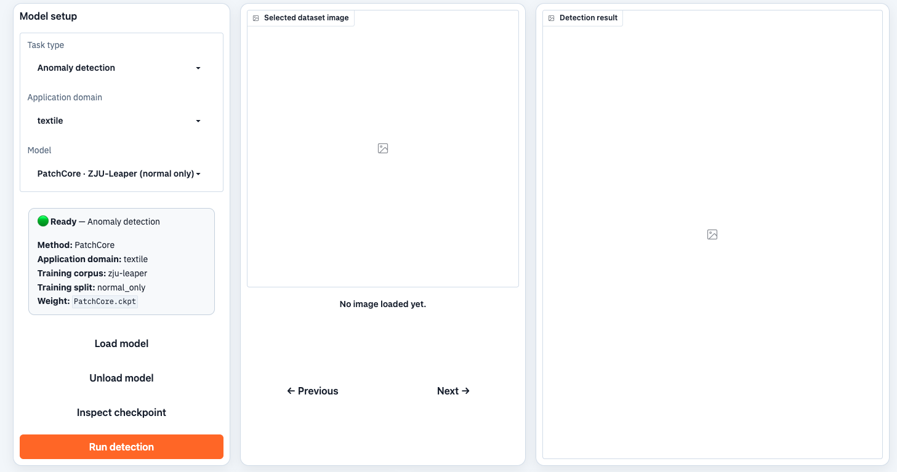

Following Step 5, the image to be evaluated was selected and loaded:

  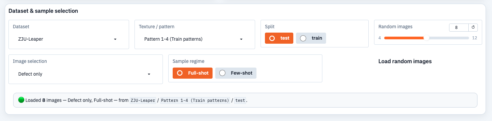

Following Step 6, anomaly detection was executed successfully. The resulting output confirms that the platform and its configuration are working correctly, so the remaining tests can be performed.

  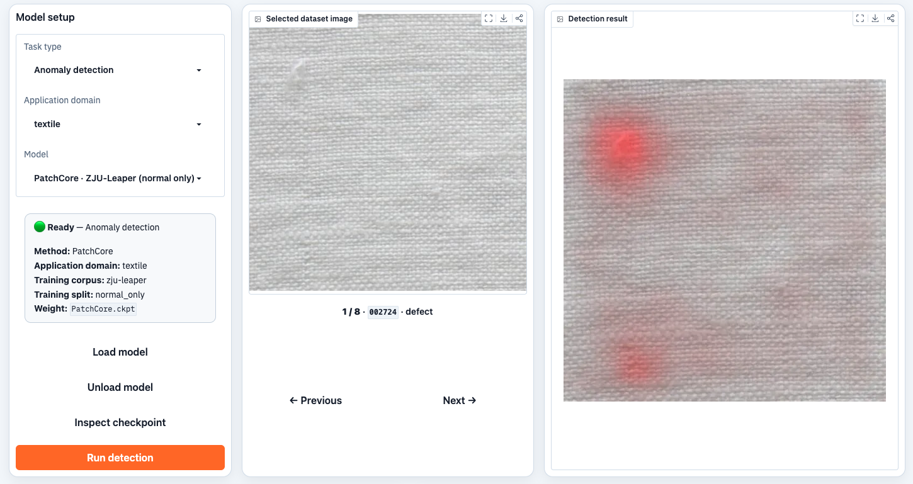

### 2.2 Technical and Overhead Metrics

Following the instructions in [README §4.1.3 Benchmarking](../../README.md#413-benchmarking), the complete benchmark suite was run. The resulting data are reported below as figures.

The evaluated configuration:

| Item | Value |
| :---: | :---: |
| Dataset | [ZJU-Leaper](../../README.md#32-supported-datasets) test split |
| Samples | 350 in total |
| Input size | 640 × 640 |
| Precision | fp32 |
| Metrics | [Image, pixel, instance and overhead](../../README.md#33-supported-metrics) |
| Evaluated configurations | 19 |

 

#### 2.2.1 Technical Metrics: Image Level

This part evaluates the image-level metrics defined by [README §3.3.1](../../README.md#331-technical-metrics-image-level):

- **Image AUROC** (Area Under the Receiver Operating Characteristic curve)**:** the probability that a defective image is ranked above a normal one. 0.5 is random guessing, 1.0 is perfect, and no decision threshold is needed.
- **Image Precision:** the share of images flagged as defective that really are defective.
- **Image Recall:** the share of truly defective images that are flagged.
- **Image F1:** the balance of precision and recall in one number; it drops when either is poor.

**Key observation:** The defect detection models lead this axis: YOLO11n and YOLOv8n both reach 0.9965 AUROC. Their precision is 1.000, but recall is only 0.600 and 0.571, so their F1 scores fall to 0.750 and 0.727. Among anomaly detection models, PatchCore leads at 0.9932, while GANomaly, Reverse Distillation, and SuperSimpleNet are close to chance (0.65, 0.62, and 0.59).

<strong>Figure 1: Image-level metrics</strong>

  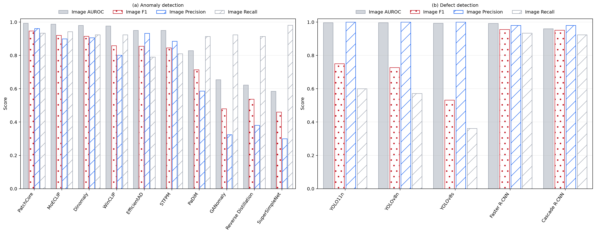

One group of four bars per model: (1) Image AUROC, (2) Image F1, (3) Image Precision, (4) Image Recall. An absent bar means the model reports nothing for that metric, never a zero. DETR's F1 / precision / recall are 0.000 rather than missing — it scores no box above the evaluation floor, so its derived image score is 0. All 16 models that emit an image-level score are shown: 10 anomaly detection models and 6 defect detection models. The latter are scored from their highest-confidence box per image.

 

<strong>Figure 2: Image-level precision-recall and ROC, anomaly detection models</strong>

  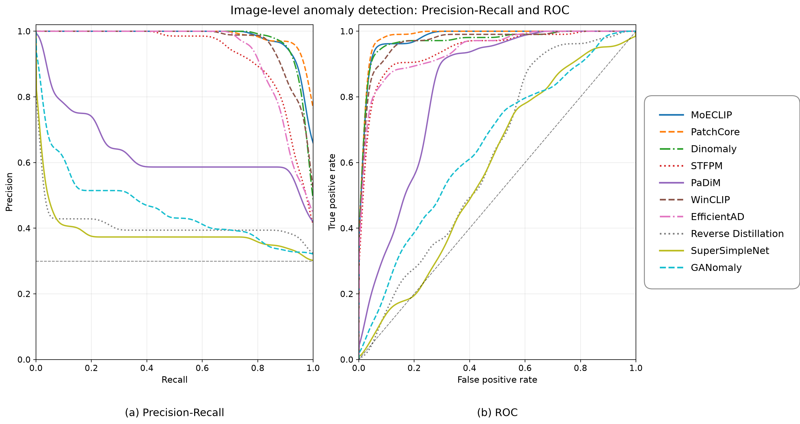

**(a)** precision-recall, **(b)** ROC, over the 10 anomaly detection models. Curves are smoothed for display only — a Gaussian kernel over a dense resampling of the empirical staircase; the AP and AUROC in each legend are computed from the unsmoothed data. The x- and y-ranges can be changed with `--xlim` / `--ylim`.

 

<strong>Figure 3: Image-level precision-recall and ROC, defect detection models</strong>

  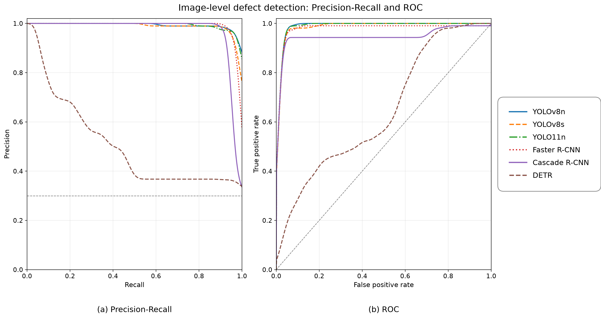

**(a)** precision-recall, **(b)** ROC, over the 6 defect detection models. DETR appears here: its AUROC (0.65) and AP (0.50) are real, readable numbers even though its box metrics are degenerate.

 

#### 2.2.2 Technical Metrics: Pixel Level

This part evaluates the pixel-level metrics defined by [README §3.3.2](../../README.md#332-technical-metrics-pixel-level):

- **Pixel AUROC:** the probability that a defective pixel is ranked above a normal one, pooled over the pixels of all images. 0.5 is random guessing.
- **Pixel AUPRO:** the share of each defective region that is covered before the false-positive rate reaches a fixed limit. Every region counts equally, so a small defect is not hidden by a large one.
- **Pixel F1:** the match between predicted and true defect pixels at a fixed pixel threshold, penalised by missed pixels and by extra pixels.
- **IAP (Instance Average Precision):** the average precision over connected defect regions, with every region weighted equally.

**Key observation:** MoECLIP leads localization by a wide margin (0.9857 AUROC and 0.9701 AUPRO), while SuperSimpleNet ranks last (0.4547 and 0.5033). Pixel F1 and mIoU remain low because the pixel threshold was not calibrated in this run. AUROC and AUPRO do not require a threshold and are therefore more informative here.

<strong>Figure 4: Pixel-level metrics on the A100 server</strong>

  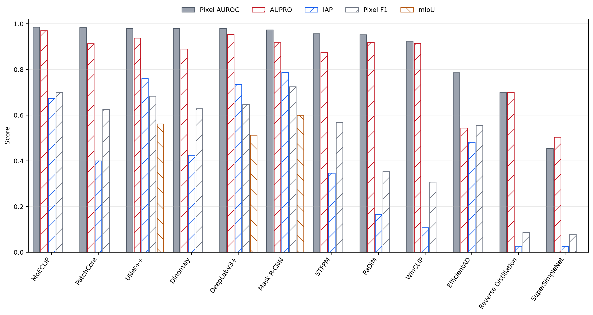

The chart mixes two metric families and a group carries only the family its output supports. Bars per model: (1) Pixel AUROC, (2) AUPRO, (3) IAP, (4) Pixel F1, (5) mIoU. Pixel AUROC, AUPRO and IAP sweep a threshold over a *continuous* score map; Pixel F1 and mIoU need only one binary mask, which is why the three mask models report two bars and the anomaly detection models four. `dice` is not plotted: for a binary mask it is numerically identical to `pixel_f1`.

 

The figure includes all nine models that emit a per-pixel anomaly map.

 

<strong>Figure 5: Pixel-level precision-recall and ROC, anomaly detection models</strong>

  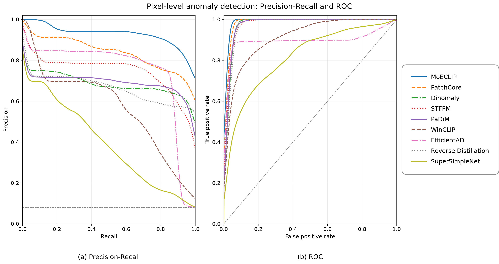

**(a)** precision-recall, **(b)** ROC, over the 9 anomaly detection models that persist a continuous anomaly map. The three mask models (UNet++, DeepLabV3+, Mask R-CNN) cannot appear: a binarised mask has no score to sweep, so it yields a single operating point rather than a curve. Their pixel quality is in Figure 4.

 

The three segmentation models are the other pixel-level producers; their Pixel F1 and mIoU are the last two bar styles in Figure 4. They report no threshold-free pixel metric because their output is a binary mask rather than a score map.

#### 2.2.3 Technical Metrics: Instance Level

This part evaluates the instance-level metrics defined by [README §3.3.3](../../README.md#333-technical-metrics-instance-level):

- **AP:** box precision–recall quality averaged over IoU thresholds 0.50–0.95 (COCO style); higher is better.
- **AP50 / AP75:** AP at a single IoU threshold. 0.50 accepts a loosely placed box, 0.75 demands a tight one, where IoU is the overlap between a predicted box and the true box.
- **Precision:** the share of reported boxes that overlap a real defect (IoU ≥ 0.50).
- **Recall:** the share of real defects covered by a reported box.
- **F1:** the balance of box precision and recall in one number.
- **TP / FP / FN:** the underlying counts, namely defects found, spurious boxes and defects missed.

**Key observation:** The detectors form two groups. YOLO variants are precise (0.857–0.929) but miss many defects (recall 0.214–0.363). The two R-CNN detectors have higher recall (0.692 and 0.681) but lower precision (0.550 and 0.633). Cascade R-CNN has the best AP50 (0.6428) and F1 (0.6561). DETR finds no evaluated defect (TP 0, FP 0, FN 182).

<strong>Figure 6: Instance-level detection metrics</strong>

  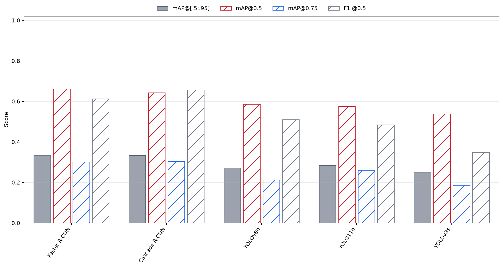

Bars per model: (1) mAP@[.5:.95], (2) mAP@0.5, (3) mAP@0.75, (4) F1@0.5. DETR is excluded: its mAP is 0.0011, so its bar has no visible height and it flattens every other model. The value is still in `snapshot_audit.csv` and the model still appears in Figures 1 and 3.

 

<strong>Figure 7: Size-bucketed AP and AR</strong>

  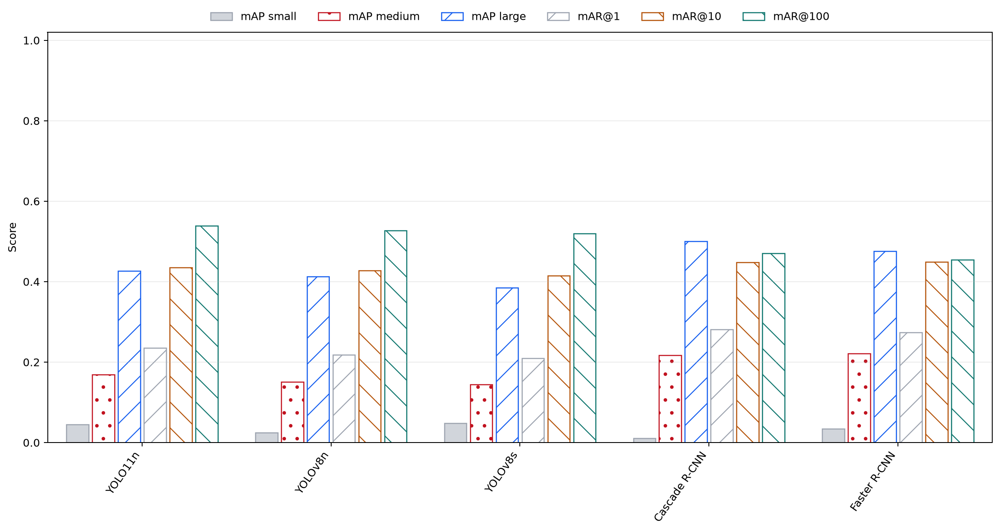

The size breakdown the four headline metrics above do not cover. Bars per model: (1) mAP small, (2) mAP medium, (3) mAP large, (4) mAR@1, (5) mAR@10, (6) mAR@100.

 

<strong>Figure 8: Detections against ground truth</strong>

  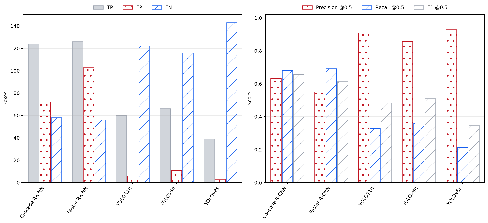

**(a)** boxes kept at the evaluation confidence floor, **(b)** the precision / recall / F1 of those same boxes. Panel (a) is what mAP does not say: whether a model found the defects at all. DETR has no bars — it emits no box above the floor.

 

- Precision, Recall, F1 and TP/FP/FN are taken at confidence threshold 0.25; AP75 is the third bar style in Figure 6, and mAP@[.5:.95] is the first.
- A standalone `adh evaluate` run on the DETR checkpoint independently confirmed `TP=0` and `FP=0`.

#### 2.2.4 Overhead Metrics: Compute

This part evaluates the compute metrics defined by [README §3.3.5](../../README.md#335-overhead-metrics-compute):

- **FPS:** images processed per second.
- **Latency mean / p95 / p99:** the time to process one image, in milliseconds; p95 and p99 describe the slowest frames rather than the average.
- **FLOPs (G):** the arithmetic work of one forward pass, in billions of operations. Fixed by the architecture, so identical on any machine.
- **Wall-time:** the total seconds the scored run took, accuracy pass included.

**Key observation:** Throughput spans more than three orders of magnitude on this machine: YOLOv8n reaches 432 FPS, while Cascade R-CNN reaches 0.82 FPS. FLOPs alone do not predict speed. YOLOv8s uses fewer FLOPs than YOLOv8n (6.99 G versus 14.90 G) but is slower (355 versus 432 FPS), showing that architecture and memory traffic also matter.

<strong>Figure 9: Compute cost on the A100 server</strong>

  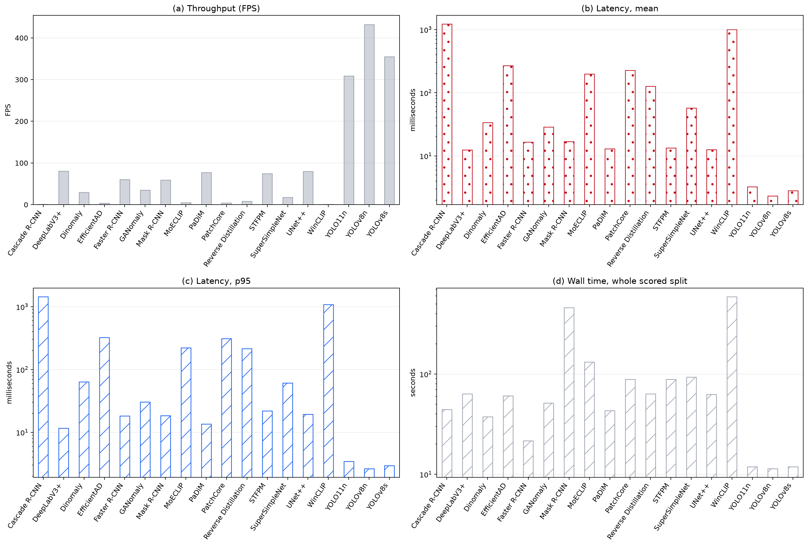

Four panels: **(a)** throughput (FPS), **(b)** mean latency, **(c)** p95 latency, **(d)** whole-split wall time. FPS is linear; latency and wall time are log-scaled because the backends span orders of magnitude. All 19 configurations are shown.

 

<strong>Figure 10: Quality versus latency, by metric granularity</strong>

  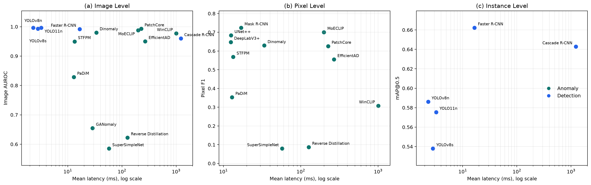

Three panels by metric granularity rather than by model family: **(a)** image level (Image AUROC), **(b)** pixel level (Pixel F1), **(c)** instance level (mAP@0.5); mean latency is on a log axis. Anomaly detection and segmentation models share panel (b), which is the only quality metric they both report.

 

#### 2.2.5 Overhead Metrics: Memory

This part evaluates the memory metrics defined by [README §3.3.6](../../README.md#336-overhead-metrics-memory):

- **Parameters (M):** the number of learned weights, in millions. Fixed by the architecture, so identical on any machine.
- **Peak memory:** the most memory used at once during the run. **Two different instruments produced this number, and which one applies to a model depends on how that model could be profiled** — see the note under Figure 11.
- **Allocator peak:** peak tensor memory live on the graphics card, which excludes the Python interpreter, host copies and the CUDA context itself.
- **Artifact size:** the checkpoint file on disk (weights plus, for a fine-tuned model, its optimizer state). This is storage, not run-time memory.

**Key observation:** Peak memory spans two orders of magnitude in this run: YOLOv8n uses 46.5 MB, compared with 4505 MB for PatchCore. The two measurements are not interchangeable. Whole-process RSS includes weights, the CUDA context, and host copies; the CUDA allocator counts GPU tensor memory only. Figure 11 therefore uses separate axes.

<strong>Figure 11: Peak memory by measurement instrument</strong>

  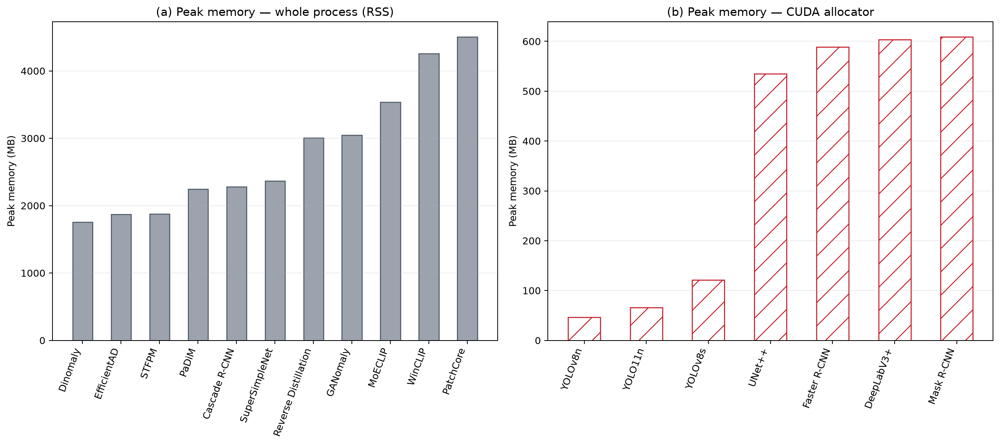

**(a) Peak memory, whole program** and **(b) Peak memory, GPU**. The two panels are **not two views of one number** and must not be compared across: panel (a) counts the entire Python process (weights, graphics-card context, host copies, framework overhead) while panel (b) counts tensor memory live on the card — a model can show 1.8 GB in (a) and 0.05 GB in (b) because its weights live in host memory. Each panel has its own y-axis, and a model appears only in the panel whose instrument measured it: 11 models in (a), 8 in (b). Which instrument a model got is decided by whether it could be exported for profiling, not by its accuracy or its size; the main report's memory section explains this and lists the instrument per model. Peak memory is a property of this host and should not be carried to another machine.

 

<strong>Figure 12: Model size and compute complexity</strong>

  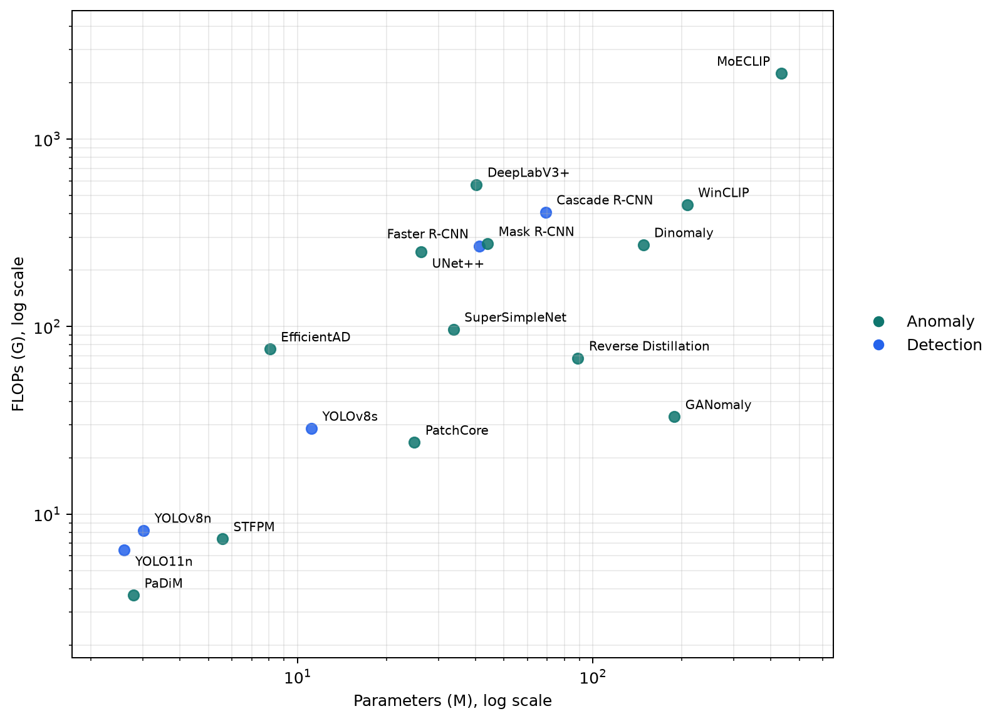

Parameters against FLOPs, both log-scaled and annotated. Both are fixed by the architecture, so unlike FPS, latency and memory they transfer to any machine. Colour marks the family: anomaly (teal) or detection (blue).

 

### 2.3 Analysis

The 19 configurations cover three model groups: **anomaly detection (AD)**, **defect detection (DD)**, and **segmentation (SEG)**. They are compared on the metric families in [README §3.3](../../README.md#33-supported-metrics): image level, pixel level, instance level, and overhead. Figure 13 reports separate technical, memory, and compute ranks; models are compared only with models that report the same metrics.

<strong>Figure 13: Three-dimensional ranking</strong>

  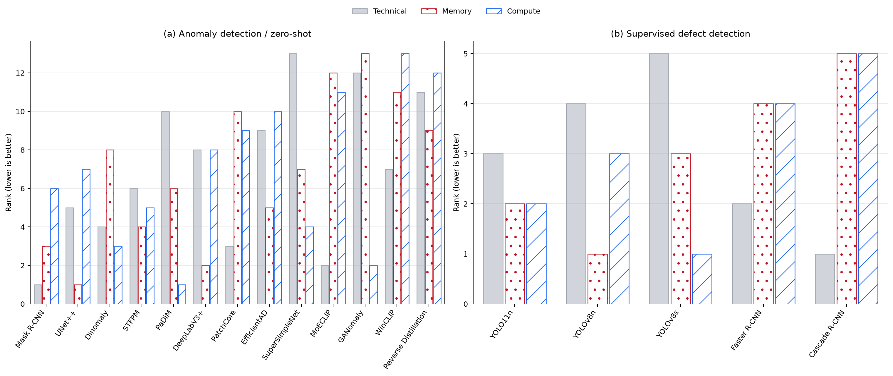

**(a)** anomaly detection / zero-shot, **(b)** supervised defect detection — split because an anomaly model and a detector were never measured on the same metrics. Each model gets three bars: its rank within its own panel on **Technical** (the image + pixel + instance accuracy tables), **Memory** and **Compute** (the two overhead tables). Every metric is scored in the direction the project's metric taxonomy declares for it (`higher` / `lower`; `neutral` and non-numeric columns are skipped), min-max normalized across the panel, and a model's dimension score is the average of the metrics it actually reports — so reporting fewer metrics is neither punished nor rewarded. All three bars are ranks (1 = best) on one axis; models are ordered by their mean rank, which is not drawn, because a fourth series on a rank axis reads as a fourth measurement rather than as a summary. Panel (a) includes the three segmentation models, which the project classifies as pixel-level anomaly detection, so it ranks 13 models rather than the 10 anomaly backends alone.

 

- **PatchCore:** strongest anomaly image score (AUROC 0.9932) and good localization; its weakness is very high memory use.
- **MoECLIP:** best pixel localization (AUROC 0.9857, AUPRO 0.9701) and strong image-level performance; it is memory-intensive and not the fastest option.
- **Dinomaly:** balanced image- and pixel-level results; it does not lead either metric family.
- **EfficientAD:** moderate image-level performance with relatively low overhead; its pixel localization trails the leading anomaly detection models.
- **PaDiM:** relatively low compute cost; its image and pixel scores are weaker than the leading anomaly detection models.
- **STFPM:** balanced image-level precision and recall with solid pixel AUROC; its pixel F1 remains modest.
- **WinCLIP:** strong image-level ranking with modest accuracy elsewhere; its throughput is close to 1 FPS.
- **GANomaly, Reverse Distillation, and SuperSimpleNet:** lower image-level performance; SuperSimpleNet also has the weakest pixel localization.
- **YOLO11n and YOLOv8n:** highest image AUROC (0.9965), high precision, and real-time throughput; their recall is limited, so they miss some defects.
- **YOLOv8s:** maintains high precision but is slower and has lower recall than the smaller YOLO variants.
- **Faster R-CNN and Cascade R-CNN:** higher recall and better instance completeness than YOLO; they require substantially more compute, and Cascade R-CNN is the slowest detector.
- **DETR:** produces no valid detection at the evaluation threshold and is therefore unsuitable for this test configuration.
- **Mask R-CNN, UNet++, and DeepLabV3+:** provide binary segmentation masks. Mask R-CNN has the best Pixel F1 (0.7242), followed by UNet++ (0.6833) and DeepLabV3+ (0.6477); their output does not support threshold-free pixel curves.

Overall, the choice depends on the deployment goal: YOLO11n or YOLOv8n for fast, precise screening; R-CNN models when recall is more important; MoECLIP for pixel localization; and PatchCore when image-level anomaly ranking is the priority.

**Scope.** Every number here describes this host. Parameter counts and FLOPs are fixed by the architecture and transfer to any machine; FPS, latency and peak memory do not.

## 3. Extensibility

### 3.1 Adding a New Dataset

Following [README §6.1](../../README.md#61-example-add-a-small-anomaly-dataset), the `bottle` category of MVTec AD was copied into a new dataset root, `datasets/general/Bottle`, and PatchCore was trained and tested on it.

<strong>Table 15: Extensibility validation — PatchCore on the newly added Bottle dataset</strong>

| Image AUROC | Pixel AUROC | Pixel AUPRO | IAP |
| :---: | :---: | :---: | :---: |
| 1.0000 | 0.9935 | 0.9934 | 0.8461 |

 

The results are usable, confirming that the new dataset was added successfully and that PatchCore trained on it.

### 3.2 Adding the YOLO 26 Model

Following [README §6.2](../../README.md#62-example-add-a-yolo-26-model), YOLO 26 was added to the `ultralytics` backend:

- **Preset entry** — `yolo26n` variant and alias in `presets.py`
- **Model configuration** — `configs/models/ultralytics_yolo26_example.yaml`
- **Registry row** — one `yolo26n` entry in `configs/registry/models.yaml`
- **Training run** — ZJU-Leaper, test mode (a pipeline check, not an accuracy run): 1 epoch, batch 2, 640 × 640 input, 8 training and 8 validation samples

The run produced a new model, registered as `textile/artifacts/models/yolo26n_yolo26n_zju_leaper.pt` with 2.50 M parameters, confirming that YOLO 26 was added successfully.

## 4. Discussion

- **Training budgets are short.** Several entries were trained for only a few steps — the anomaly smoke configuration is 1 epoch on 8 images — so the weaker results in §2.3 reflect the run budget as much as the architecture.
- **Overhead metrics are host-defined.** FPS, latency and peak memory are properties of the machine that measured them — this run is an A100 server — so they should not be carried to another host. Only FLOPs and parameter counts are host-independent.
- **Coverage gaps.** MambaAD untested; MoECLIP scored on MVTec AD rather than ZJU-Leaper; cross-domain ([README §3.3.4](../../README.md#334-technical-metrics-cross-domain)) not measured on this run; `LMEI`, `Max streams @budget`, `1-stream latency`, `resolution slope` and power/energy not produced.
